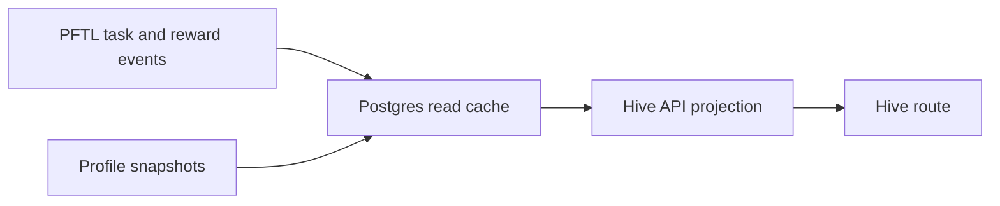

# Hive

Hive is the network coordination surface. It shows active projects, task routing, operator load, and project-scoped activity in one place so members can understand where the network is concentrating attention.

The current implementation is a UX mock ported into the real app shell. It is intentionally static while the next workstream defines the live data model and routing engine.

## User Surface

The Hive route is available at `#hive` from the primary sidebar. The surface contains:

- active projects with contributor previews, task counts, and routed PFT totals
- a routing feed showing recent task state transitions
- allotted operators with load and availability
- a project detail page for the full `PFT distribution v3` mock project
- a collapsed `Hive Context` section at the bottom of the page

The project detail page is layered as:

1. About
2. Contributors
3. Tasks
4. Activity

## Hive Input

Chat has a `Hive Input` mode in the composer `+` menu. It is a persistence action, not a model call and not a billed chat response.

When the user selects `Hive Input`, the composer changes mode and the next message is saved to `Hive Context`. The server also records the user message and a short acknowledgement in chat history so the conversation remains understandable after navigation.

`Hive Context` is a network context document built from user-submitted entries. It is grouped by user and shown collapsed on the Hive page. Expanding the section reveals entries by contributor with timestamp and source chat title.

Current endpoint:

- `GET /api/hive/context` returns the grouped Hive Context document.
- `POST /api/hive/context` stores one signed-in user's Hive Input entry and records the chat acknowledgement.

## Technical Architecture

The production app does not import from `mocks/hive.jsx`. The mock is preserved as design input, and the app route is implemented as normal source code:

- `src/features/hive/HiveView.jsx` renders the Hive index and project detail drill-in.
- `src/features/hive/hive-data.js` contains the temporary static project/operator data.
- `src/features/hive/hive.css` contains the isolated styling for the surface.
- `src/main.jsx` registers `#hive`, adds the sidebar entry, and lazy-loads the view.
- `server/hive-routes.js` serves Hive Context reads and writes.
- `server/repositories/hive-context.js` persists and groups Hive Context entries.
- `server/db/migrations/027_hive_context_entries.sql` creates the Hive Context table.

## Current Data Boundary

Project, routing feed, and allotted-operator data are static for this milestone. They do not yet read from Postgres, PFTL task projections, profile snapshots, or a routing worker.

Hive Context is live Postgres-backed app data. It is not on-chain and is not yet used by the system Network Task worker. It is the first user-authored input surface for future Hive project/task generation.

The expected live replacement path is:

## Future Live Sources

The likely production data sources are:

- `task_projections` for task state, rewards, and project assignment
- `hive_context_entries` for user-submitted network context
- public profile snapshots for operator role and skill summaries
- daily airdrop and reward history for contribution weighting
- a future hive project table for project identity, lifecycle, and priority
- PFTL transaction cache rows for proof anchors and forensic drill-in
