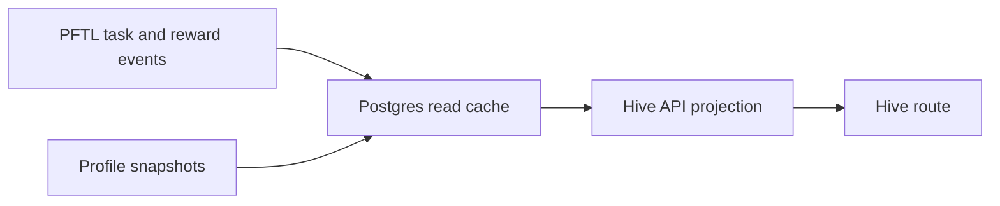

# Hive

Hive is the network coordination surface. It shows active projects, task routing, operator load, and project-scoped activity in one place so members can understand where the network is concentrating attention.

The current implementation is a UX mock ported into the real app shell. It is intentionally static while the next workstream defines the live data model and routing engine.

## User Surface

The Hive route is available at `#hive` from the primary sidebar. The surface contains:

- active projects with contributor previews, task counts, and routed PFT totals
- a routing feed showing recent task state transitions
- allotted operators with load and availability
- a project detail page for the full `PFT distribution v3` mock project

The project detail page is layered as:

1. About
2. Contributors
3. Tasks
4. Activity

## Technical Architecture

The production app does not import from `mocks/hive.jsx`. The mock is preserved as design input, and the app route is implemented as normal source code:

- `src/features/hive/HiveView.jsx` renders the Hive index and project detail drill-in.
- `src/features/hive/hive-data.js` contains the temporary static project/operator data.
- `src/features/hive/hive.css` contains the isolated styling for the surface.
- `src/main.jsx` registers `#hive`, adds the sidebar entry, and lazy-loads the view.

## Current Data Boundary

Hive data is static for this milestone. It does not yet read from Postgres, PFTL task projections, profile snapshots, or a routing worker.

The expected live replacement path is:

## Future Live Sources

The likely production data sources are:

- `task_projections` for task state, rewards, and project assignment
- public profile snapshots for operator role and skill summaries
- daily airdrop and reward history for contribution weighting
- a future hive project table for project identity, lifecycle, and priority
- PFTL transaction cache rows for proof anchors and forensic drill-in
