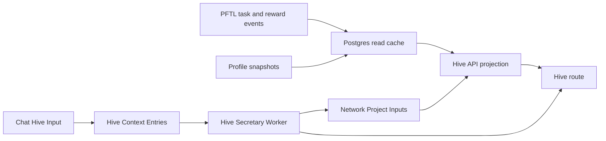

# Hive

Hive is the network coordination surface. It shows active projects, task routing, operator load, and project-scoped activity in one place so members can understand where the network is concentrating attention.

The current implementation uses Postgres-backed network project records plus live Hive Context and Hive Secretary data. The original Hive mock is preserved only as design reference.

## User Surface

The Hive route is available at `#hive` from the primary sidebar. The surface contains:

- active projects with contributor previews, task counts, and routed PFT totals
- a routing feed showing recent task state transitions
- allotted operators with load and availability
- a project detail page for `PFT distribution v3`, backed by the `network_projects` read model
- a collapsed `Hive Context` section at the bottom of the page with the latest Hive Secretary report and collapsible raw inputs

The project detail page is layered as:

1. About
2. Contributors
3. Tasks
4. Activity

## Hive Input

Chat has a `Hive Input` mode in the composer `+` menu. It is a persistence action, not a model call and not a billed chat response.

When the user selects `Hive Input`, the composer changes mode and the next message is saved to `Hive Context`. The server also records the user message and a short acknowledgement in chat history so the conversation remains understandable after navigation.

`Hive Context` is a network context document built from user-submitted entries. It is grouped by user and shown collapsed on the Hive page.

Expanding the section shows the current `Hive Secretary` report first. Raw user inputs are behind a second collapsible `Raw inputs` control so the page reads like a network report by default instead of a transcript dump. Raw inputs show contributor, timestamp, body, and whether the entry came from a validated linked wallet. Source chat title is intentionally not displayed because it is usually not useful network context.

## Hive Secretary

Hive Secretary is an async report worker over validated-wallet Hive Inputs.

When a signed-in user posts a Hive Input:

1. `POST /api/hive/context` stores the raw input.
2. The route checks the account's linked wallet through `getLinkedWallet`.
3. If the account has a linked wallet, the entry is marked `wallet_validated = true`.
4. Validated entries enqueue a Hive Secretary job.
5. `server/hive-secretary-worker.js` calls OpenRouter using `deepseek/deepseek-v4-pro` with ZDR provider settings.
6. The completed report is stored in `hive_secretary_reports`.
7. `GET /api/hive/context` returns both the grouped raw context and the current Secretary report.

Hive Secretary uses `prompts/hive/hive_secretary_v1.md`. The prompt returns strict JSON with:

- `summary`
- `project_signals`
- `network_implications`
- `open_questions`
- `next_system_focus`

The worker is source-bound: it summarizes validated Hive Inputs and classifies project signals into the current Hive project types. It does not create tasks yet.

Current endpoint:

- `GET /api/hive/projects` returns active network projects, project task rows, contributor rollups, activity rows, and the latest Hive Secretary input reference.
- `GET /api/hive/context` returns the grouped Hive Context document plus Hive Secretary report/job state.
- `POST /api/hive/context` stores one signed-in user's Hive Input entry, records the chat acknowledgement, and queues Hive Secretary when the user has a linked wallet.

## Technical Architecture

The production app does not import from `mocks/hive.jsx`. The mock is preserved as design input, and the app route is implemented as normal source code:

- `src/features/hive/HiveView.jsx` renders the Hive index and project detail drill-in.
- `src/features/hive/hive.css` contains the isolated styling for the surface.
- `src/main.jsx` registers `#hive`, adds the sidebar entry, and lazy-loads the view.
- `server/hive-routes.js` serves Hive project, Hive Context, and Hive Secretary reads and writes.
- `server/hive-secretary-worker.js` processes validated Hive Inputs through DeepSeek V4 Pro with ZDR.
- `server/repositories/hive-context.js` persists raw Hive Context entries, Secretary jobs, and Secretary reports.
- `server/repositories/hive-projects.js` reads active network projects and links the latest Secretary report as a project input.
- `server/db/migrations/027_hive_context_entries.sql` creates the Hive Context table.
- `server/db/migrations/028_hive_secretary_reports.sql` adds linked-wallet validation metadata and Secretary job/report tables.
- `server/db/migrations/029_hive_network_projects.sql` creates and seeds the current network project read model.
- `prompts/hive/hive_secretary_v1.md` is the source-controlled Secretary prompt.

## Current Data Boundary

Active projects, project detail, project task rows, contributor previews, allotted operators, and routing feed now read from Postgres. `PFT distribution v3` is seeded as an apriori network project record so tasks can later be allocated into it instead of creating the project after the fact.

Hive Context is live Postgres-backed app data. It is not on-chain. Hive Secretary is also Postgres-backed and regenerates from validated-wallet Hive Inputs after new entries arrive.

The Secretary report is not canonical task state. It is an operator-readable network context report and is linked into active project rows as an input. This makes it available to the future system Network Task worker without pretending the report is itself a task.

The expected live replacement path is:

## Future Live Sources

The likely production data sources are:

- `task_projections` for task state, rewards, and project assignment
- `network_projects`, `network_project_task_refs`, `network_project_contributors`, and `network_project_activity` for the current Hive project read model
- `hive_context_entries` for user-submitted network context
- `hive_secretary_reports` for the current synthesized network context report
- public profile snapshots for operator role and skill summaries
- daily airdrop and reward history for contribution weighting
- PFTL transaction cache rows for proof anchors and forensic drill-in
