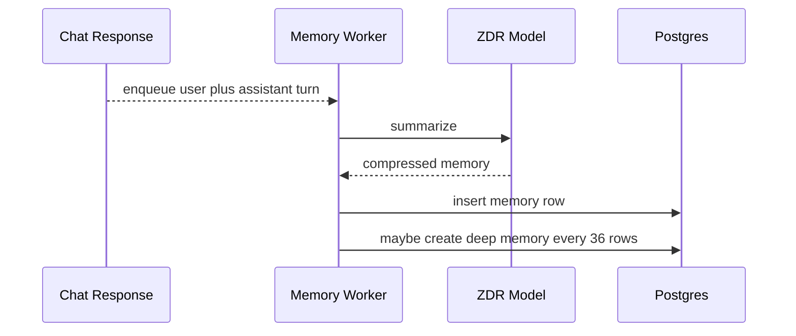
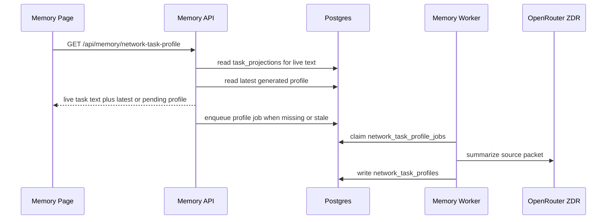

# Memory

Memory is lightweight compression of user and assistant interactions. It helps future chats know what the user has been exploring without replaying entire conversations.

## User Flow

1. A user receives an assistant response.
2. The app returns the response immediately.
3. A background worker summarizes the user request and assistant response.
4. Every 36 memory rows, a deep memory job snapshots the exact 36 source memory row IDs and compresses those summaries into broader user, assistant, and memory bullets.
5. The Memory page renders live task routing context directly from task projections.
6. A separate async Network Task Profile job can summarize the source packet for future network task routing.
7. The Memory page lets the user inspect what the system remembers and what the routing profile saw.

## Technical Architecture

The memory UI is `src/features/memory/MemoryView.jsx`. Backend memory logic is in `server/chat-memory-worker.js`, `server/chat-memory-context.js`, `server/repositories/chat-memory.js`, and `server/repositories/network-task-profile.js`. Migrations are `server/db/migrations/004_chat_memory.sql`, `server/db/migrations/005_deep_chat_memory.sql`, `server/db/migrations/013_deep_memory_snapshots.sql`, and `server/db/migrations/024_network_task_profiles.sql`.

Private memory jobs use the configured OpenRouter ZDR model path. Memory writes are not billed to the user right now. Ordinary chat model tokens remain billable.

Deep-memory jobs are stable snapshots. `chat_deep_memory_jobs.source_entry_ids` stores the exact 36 `chat_memory_entries.id` values selected when the block is queued. The worker reads those IDs directly instead of recalculating the block later from timestamps, so backfills, imports, or corrected timestamps cannot change what a queued deep-memory job summarizes. `chat_memory_entries` also enforces one `deep_memory` row per account and block index, so retrying or recreating a deep-memory job updates the existing block summary rather than creating duplicates.

Network Task Profile jobs use the same memory worker and OpenRouter ZDR route. The prompt is `prompts/memory/network_task_profile_v1.md`. The API route is `GET /api/memory/network-task-profile`; `POST /api/memory/network-task-profile` requests a refresh. The generated profile is not required for the page to render. Live task context is built from `task_projections` on every route read and is returned even while a profile job is pending.

## Network Task Profile

The Memory page now has two task-routing layers:

- Generated Network Task Profile: an async LLM-generated routing summary stored in `network_task_profiles`.
- Live Task Routing Context: real-time text from current task projection rows.

The live task block is grouped as Proposed, Outstanding, Verification, Refused, and Rewarded. It shows task name, state, description, reward, outcome when available, and updated time. It intentionally does not show CIDs, transaction hashes, event IDs, reducer names, raw JSON, or full forensics.

The generated profile source packet contains:

- account and profile snapshot;
- full current context document text;
- up to the last 3 deep memories;
- current live task routing text;
- current proposed, outstanding, and verification tasks;
- last 6 refused tasks;
- last 6 rewarded tasks.

The packet is private and visible only in the Memory page. It is stored for audit so users can see exactly what was sent to the model.

## Data Model

- Memory row: date, conversation title, user summary, assistant summary, memory summary.
- Deep memory job: account, block number, exact source memory entry IDs, retry and lock state.
- Deep memory row: batch number, user bullets, assistant bullets, combined memory summary. There is only one deep-memory row per account/block.
- Network Task Profile job: account, lock/retry state, source packet JSON/text, source packet digest.
- Network Task Profile row: source packet, generated output JSON/text, provider, model, prompt version, prompt digest, usage metadata, completed timestamp.
- Chat context injection: last 3 deep memories plus last 36 memory summaries.

## Diagram

## Failure Modes

- Memory jobs must not block chat responses.
- Network Task Profile jobs must not block Memory page rendering.
- Live task context should remain current even if profile generation fails.
- Memory failure should be logged and retryable.
- User-derived memory should be presented as memory context, not as app policy.
- Users should be able to inspect memory entries for trust.
