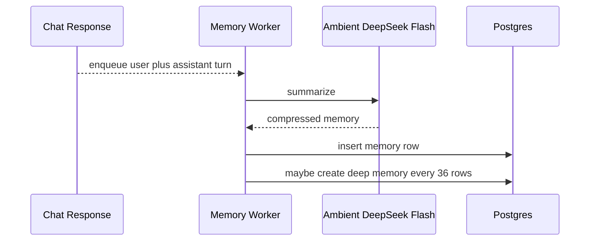
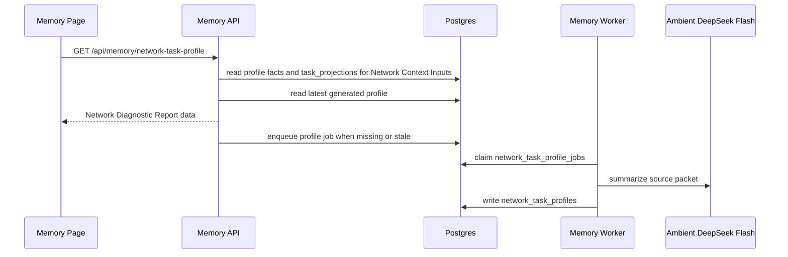

# Memory

Memory is lightweight compression of user interactions and rewarded work. It helps future chats retain what the user has explored and accomplished without replaying entire conversations or task forensics.

## User Flow

1. A user receives an assistant response.
2. The app returns the response immediately.
3. A background worker summarizes the user request and assistant response.
4. When a positive task reward becomes canonical, Task Node snapshots the task, submission, verification, and reward events into an idempotent rewarded-task memory job.
5. DeepSeek Flash summarizes that rewarded task into Recent Memory. A bounded backfill scan repairs any reward whose enqueue was missed during a crash or deploy.
6. Every 36 recent memory rows, including rewarded-task memories, a deep memory job snapshots the exact 36 source memory row IDs and compresses those summaries into broader user, assistant, and memory bullets.
7. The Memory page renders a Network Diagnostic Report that combines the generated Network Task Profile with live Network Context Inputs from profile/task projections.
8. The async Network Task Profile job summarizes the source packet for future network task routing, while live inputs continue to refresh independently.
9. The Memory page lets the user inspect what the system remembers, what the generated report says, and what inputs the report is built from.

## Technical Architecture

The memory UI is `src/features/memory/MemoryView.jsx`. Backend memory logic is in `server/chat-memory-worker.js`, `server/chat-memory-context.js`, `server/repositories/chat-memory.js`, `server/repositories/task-reward-memory.js`, and `server/repositories/network-task-profile.js`. Rewarded-task memory is added by `server/db/migrations/108_rewarded_task_memory.sql`.

Memory jobs use Ambient's pinned `fast_text` capability, `deepseek/deepseek-v4-flash-0731`, with JSON mode and reasoning disabled. The rewarded-task prompt is `prompts/memory/rewarded_task_memory_v1.md`. Rewarded-task jobs disable the normal fast-text capacity fallback: if DeepSeek Flash is unavailable, the durable job retries instead of silently using GLM. Memory writes are not billed to the user right now. Ordinary chat model tokens remain billable.

Deep-memory jobs are stable snapshots. `chat_deep_memory_jobs.source_entry_ids` stores the exact 36 `chat_memory_entries.id` values selected when the block is queued. The worker reads those IDs directly instead of recalculating the block later from timestamps, so backfills, imports, or corrected timestamps cannot change what a queued deep-memory job summarizes. `chat_memory_entries` also enforces one `deep_memory` row per account and block index, so retrying or recreating a deep-memory job updates the existing block summary rather than creating duplicates. The enqueue path repairs any completed or failed deep-memory job whose visible `deep_memory` row is missing; it reuses the stored source snapshot and sends that block back to the worker.

Production incident note, June 4, 2026: turn memory appeared stuck at 36 because the Memory API returned only the latest 36 turn-memory rows and the UI displayed the returned window count instead of the stored total. The account actually had 156 turn-memory rows. Deep memory was separately broken because `clear_deep_memory` deleted `chat_memory_entries.kind = 'deep_memory'` rows without deleting the associated `chat_deep_memory_jobs` rows. Those jobs stayed marked `completed`, so backfill treated the deep-memory blocks as already handled even though no visible deep-memory summaries existed. Some old job snapshots also pointed at turn-memory row IDs that had since been deleted, so naive requeueing failed with `deep_memory_job_source_incomplete`.

The repair contract is now:

- the Memory API returns stored totals separately from the bounded display window;
- clearing Deep Memory deletes both deep-memory entry rows and deep-memory job rows;
- missing deep-memory rows requeue the corresponding completed or failed jobs;
- if the stored 36-row source snapshot is stale and no deep-memory output row exists, repair refreshes the snapshot from the current 36-row block before requeueing.

Network Task Profile jobs use the same Ambient DeepSeek Flash memory worker. The prompt is `prompts/memory/network_task_profile_v2.md`. The API route is `GET /api/memory/network-task-profile`; `POST /api/memory/network-task-profile` requests a refresh from the Memory page. Generation is automatic: a job is queued once an account has at least two positively rewarded tasks, both when rewarded task projections are imported and during the memory worker backfill pass, and opening the Memory page queues a job immediately when no profile exists yet. There is no request, application, or approval flow for the report, and chat surfaces must not tell users to ask for one; the Hive and Help prompts state this same path. The generated profile is not required for the page to render. Network Context Inputs are built from profile data and routable `task_projections` on every route read and are returned even while a profile job is pending.

This page is the current product contract for Memory and Network Diagnostic
Report behavior. Historical Network Task Profile planning has been folded into
this surface doc and the Network Task Profile Worker runbook.

## Network Task Profile

The Memory page shows one task-routing report with two layers:

- Generated Network Task Profile: an async LLM-generated diagnostic report stored in `network_task_profiles`.
- Network Context Inputs: real-time public profile facts plus current task projection text.

In the UI, these are concatenated in the same Network Diagnostic Report card. The generated report appears first because it is the human-readable interpretation. Network Context Inputs appear immediately underneath as the live evidence block, so the user can compare the model summary with the current profile/task state without opening a second section.

The task state block inside Network Context Inputs is grouped as Proposed, Outstanding, Verification, Refused, and Rewarded. It shows task name, state, description, reward, and outcome when available. It intentionally does not show updated timestamps, CIDs, transaction hashes, event IDs, reducer names, raw JSON, or full forensics.

Network Context Inputs filters out non-routable projections. Blank `unknown` projections, orphan historical submissions, and rows without a readable task title or description are not routing context. Those records can exist as raw PFTL cache observations, but they should not be promoted into the user-visible task routing packet.

The generated profile source packet contains:

- account and profile snapshot;
- full current context document text;
- up to the last 3 deep memories;
- current Network Context Inputs text;
- current proposed, outstanding, and verification tasks;
- last 6 refused tasks;
- last 6 rewarded tasks.

The packet is private and visible only in the Memory page. It is stored for audit so users can see exactly what was sent to the model.

The generated profile answers three questions only: current focus, primary contribution ability, and "Companies this User Would Move the Needle At." It does not generate "best task types", avoidance lists, routing reasons, or caveats. The routing layer can use the report as context, but the user-facing text should read like a diagnostic understanding of the member rather than a task assignment policy.

## Memory Tab

The Memory tab is an audit surface. It does not silently hide model-derived profile assumptions.

The top-level UI has two tabs:

- `Memory`: the generated Network Diagnostic Report and collapsible Network Context Inputs.
- `Deep Memory`: deep memory summaries and recent turn-memory summaries from past conversations.

The Memory tab intentionally hides provider plumbing from the primary user view. It does not show prompt version names such as `network_task_profile_v2`, packet digest chips, or provider model IDs such as `deepseek/deepseek-v4-flash-*`. Those values remain stored in Postgres and visible to operators through database/status tooling.

The `Memory` tab contains `Network Diagnostic Report`:

- The first part is generated by `prompts/memory/network_task_profile_v2.md`.
- It shows the generated role title, current focus, primary contribution ability, and companies where the user would move the needle.
- The second part is `Network Context Inputs`, a collapsible live text block built directly from profile and task projection rows.

The generated report and Network Context Inputs intentionally live in the same tab. The generated report is the interpretation; Network Context Inputs are the evidence. If they disagree, the live inputs are the fresher product state, and the user can refresh the report.

The `Deep Memory` tab remains normal memory inspection:

- `Deep Memory`: the last 3 deep-memory bundles.
- `Recent Memory`: the last 36 chat-turn and rewarded-task summaries, with the total stored recent-memory count shown separately when more than 36 exist.

Users can delete individual memory rows, clear all deep-memory summaries, clear all recent turn-memory summaries, or reset the generated diagnostic report. Deletes are account-scoped hard deletes from the memory/profile tables. Clearing deep memory also deletes the associated deep-memory job rows so stale completed jobs cannot hide missing summaries. Resetting the diagnostic report deletes generated `network_task_profiles` rows and queued `network_task_profile_jobs`; it does not delete Deep Memory or Recent Memory.

## Prompt Construction

The Network Diagnostic Report prompt receives a `NETWORK TASK PROFILE SOURCE PACKET`, not raw chat history. `server/repositories/network-task-profile.js::buildNetworkTaskProfileSourcePacket` constructs that packet from bounded product state:

- `Account`: account id and identity context.
- `Network Context Inputs`: live public profile facts plus routable task state grouped by Proposed, Outstanding, Verification, Refused, and Rewarded.
- `Context Document`: the current saved context document text.
- `Deep Memory`: up to the last 3 deep-memory bundles.
- `Recently Refused Tasks`: last 6 compact refused/cancelled task summaries.
- `Recently Rewarded Tasks`: last 6 compact rewarded task summaries.

The prompt is versioned as `network_task_profile_v2`. The worker stores `prompt_version`, `prompt_digest`, `source_packet_digest`, the full source packet, provider/model metadata, and usage metadata in `network_task_profiles`. If the prompt version changes, `GET /api/memory/network-task-profile` queues a fresh async job so old profile shapes do not remain authoritative.

The prompt output contract is deliberately small:

```json
{
  "profile_title": "Concise professional role title",
  "current_focus": ["3 to 6 bullets"],
  "primary_contribution_ability": ["3 to 6 bullets"],
  "domain_expertise": ["5 to 10 public-company fit bullets"]
}
```

The UI labels `domain_expertise` as `Companies this User Would Move the Needle At`. The JSON key stays stable so existing rows and parsers do not break.

## Data Model

- Memory row: date, source title, user/task summary, outcome summary, memory summary, and kind (`turn_memory`, `rewarded_task_memory`, or `deep_memory`).
- Rewarded-task memory job: one unique row per canonical positive task reward, with a durable source snapshot, retry/lock state, and resulting memory entry id.
- Deep memory job: account, block number, exact source memory entry IDs, retry and lock state.
- Deep memory row: batch number, user bullets, assistant bullets, combined memory summary. There is only one deep-memory row per account/block.
- Network Task Profile job: account, lock/retry state, source packet JSON/text, source packet digest.
- Network Task Profile row: source packet, generated output JSON/text, provider, model, prompt version, prompt digest, usage metadata, completed timestamp.
- Chat context injection: last 3 deep memories plus last 36 memory summaries.

## Diagram





## Failure Modes

- Memory jobs must not block chat responses.
- Network Task Profile jobs must not block Memory page rendering.
- Network Context Inputs should remain current even if profile generation fails.
- Memory failure should be logged and retryable.
- A completed `chat_deep_memory_jobs` row without a matching `deep_memory` entry is not complete product state; repair must requeue it.
- A stale `source_entry_ids` snapshot may be refreshed only when the deep-memory output row is missing. Existing deep-memory rows preserve the original snapshot contract.
- User-derived memory should be presented as memory context, not as app policy.
- Users should be able to inspect memory entries for trust.
