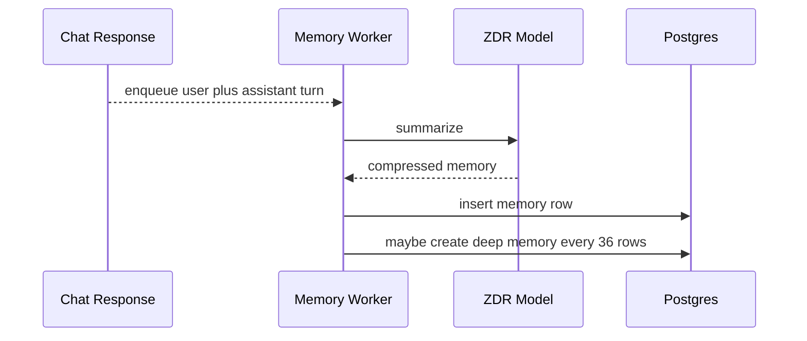

# Memory

Memory is lightweight compression of user and assistant interactions. It helps future chats know what the user has been exploring without replaying entire conversations.

## User Flow

1. A user receives an assistant response.
2. The app returns the response immediately.
3. A background worker summarizes the user request and assistant response.
4. Every 36 memory rows, a deep memory job snapshots the exact 36 source memory row IDs and compresses those summaries into broader user, assistant, and memory bullets.
5. The Memory page lets the user inspect what the system remembers.

## Technical Architecture

The memory UI is `src/features/memory/MemoryView.jsx`. Backend memory logic is in `server/chat-memory-worker.js`, `server/chat-memory-context.js`, and `server/repositories/chat-memory.js`. Migrations are `server/db/migrations/004_chat_memory.sql`, `server/db/migrations/005_deep_chat_memory.sql`, and `server/db/migrations/013_deep_memory_snapshots.sql`.

Private memory jobs use the configured OpenRouter ZDR model path. Memory writes are not billed to the user right now. Ordinary chat model tokens remain billable.

Deep-memory jobs are stable snapshots. `chat_deep_memory_jobs.source_entry_ids` stores the exact 36 `chat_memory_entries.id` values selected when the block is queued. The worker reads those IDs directly instead of recalculating the block later from timestamps, so backfills, imports, or corrected timestamps cannot change what a queued deep-memory job summarizes. `chat_memory_entries` also enforces one `deep_memory` row per account and block index, so retrying or recreating a deep-memory job updates the existing block summary rather than creating duplicates.

## Data Model

- Memory row: date, conversation title, user summary, assistant summary, memory summary.
- Deep memory job: account, block number, exact source memory entry IDs, retry and lock state.
- Deep memory row: batch number, user bullets, assistant bullets, combined memory summary. There is only one deep-memory row per account/block.
- Chat context injection: last 3 deep memories plus last 36 memory summaries.

## Diagram

## Failure Modes

- Memory jobs must not block chat responses.
- Memory failure should be logged and retryable.
- User-derived memory should be presented as memory context, not as app policy.
- Users should be able to inspect memory entries for trust.
