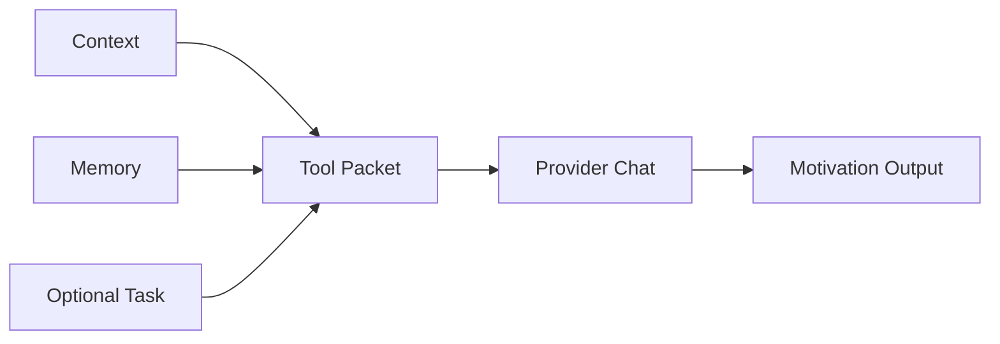

# Motivation

Motivation is a focused chat tool for turning the user's context into a clear reason to act. It should help the user reconnect a task or project to their stated goals without fabricating personal facts.

## User Flow

1. The user selects Motivation from the tools menu.
2. The app packages the current context, recent chat memory, and optional active task.
3. The model returns a concise motivational framing.
4. The output can be copied into chat or used as a task planning input.

## Technical Architecture

The current tool entry is in the sidebar and composer menus in `src/main.jsx`. The correct production shape is a small tool runner that accepts a typed packet: current context, last deep memories, last memory rows, and optional task ID.

Motivation should use existing chat provider infrastructure rather than a separate billing path. If it becomes a background job, its billing policy must be explicit.

## Data Model

- Inputs: context cache, memory cache, optional active task cache.
- Output: ordinary chat message or tool result record.
- Canonical chain state: none unless the user turns the result into a task request.

## Diagram

## Failure Modes

- Missing context should produce a useful blank-slate prompt.
- Motivation output should not invent goals.
- Tool execution should not mutate context unless the user explicitly saves it.
