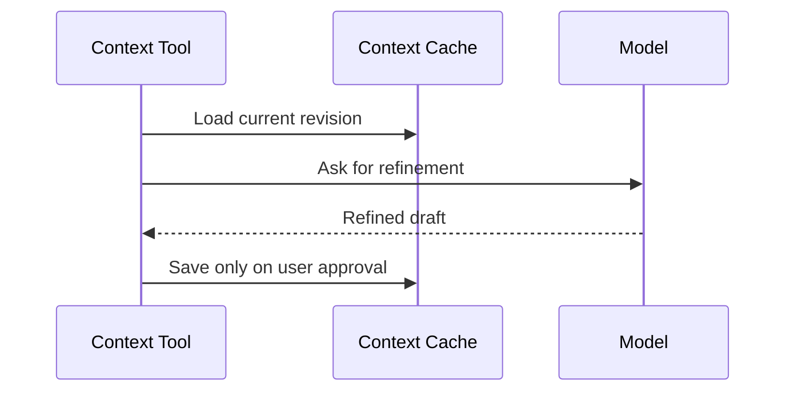

# Refine Context

Refine Context cleans up an existing context document while preserving meaning. It is for structure, clarity, and reducing drift.

## User Flow

1. The user opens Refine Context from the tools menu.
2. The app loads the current context document.
3. The model proposes a refined version.
4. The user previews the result.
5. The user explicitly saves or discards it.

## Technical Architecture

Refine Context should be a typed context operation over the context cache. It should not publish to PFTL automatically. Publishing remains a separate explicit action requiring an unlocked wallet vault.

Relevant code references are `server/repositories/context.js`, `src/features/context/context-publish.js`, and the context editor in `src/main.jsx`.

## Data Model

- Input: current context revision.
- Output: draft revision.
- Save: Postgres current context cache.
- Publish: encrypted IPFS plus PFTL pointer only after user confirmation.

## Diagram

## Failure Modes

- Preserve names, facts, dates, and explicit goals.
- Never save automatically.
- Show diff or preview before overwrite.

## Reviewer To Do List

Review implementation against this document (refine context). Mark each item when verified.

### Memory Efficiency
- [ ] List and detail views read Postgres caches with documented caps or pagination.
- [ ] Async workers handle heavy model/IPFS work; primary UX path stays non-blocking.
- [ ] Legacy refine path superseded by Chat Context Refine; no duplicate proposal storage.

### Code Quality
- [ ] Code references in doc resolve to existing modules and routes.
- [ ] Failure modes documented here have matching user-visible error handling.
- [ ] If legacy code remains, it routes through `context-edit-chat.js` or is unreachable.

### Coherence
- [ ] Surface behavior matches Architecture docs for cache vs canonical state.
- [ ] Hidden/not-exposed features labeled honestly if mentioned.
- [ ] Doc states Chat Context Refine is production path.

### Bloat
- [ ] Surface does not duplicate logic owned by shared modules or workers.
- [ ] UI state not duplicated in unrelated caches without invalidation rules.
- [ ] Remove or gate legacy modal refine if still in bundle unused.

### Security
- [ ] Account scoping enforced on all read/write API paths for this surface.
- [ ] Wallet-bound actions require linked unlocked wallet as documented.
- [ ] Context edits account-scoped; proposals require signed-in account.
