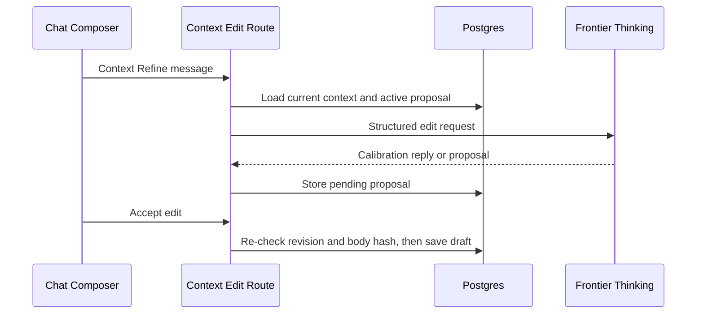

# Refine Context

Refine Context cleans up an existing context document while preserving meaning. It is for structure, clarity, and reducing drift.

## User Flow

1. The user opens Refine Context from the chat composer `+` menu, or from the sidebar More tools menu. The sidebar entry opens Chat with Context Refine already active. Signed-out users are routed to login because Context Refine is an account action.
2. The composer badge and placeholder switch to `Context Refine`, and the next message goes through the dedicated context-edit route with the current context document loaded.
3. The model returns either a calibration question or one structured edit proposal.
4. A proposal renders as an inline card in the chat thread. The user can keep talking to revise it, reject it, or accept it.
5. `Accept edit` applies the proposal to the Postgres context draft. Nothing publishes to PFTL automatically.

## Technical Architecture

Context Refine is the internal `context_edit` chat mode, not a separate modal or Context page tool. `server/product-contracts.js::chatPayload` forces it through Frontier Thinking so the user does not pick a model for durable document edits. `server/context-edit-chat.js::executeContextEditChat` loads chat history, the current context document, memory context, task state, and the active pending proposal, renders `prompts/context/context_edit_jobs_v1.xml` with a plain and a line-numbered copy of the document, and calls the OpenAI Responses API with structured output, `store=false`, and tools disabled.

Proposals are stored in `context_edit_proposals` through `server/repositories/context-edit.js`. `Accept edit` posts to `/api/context/edit/proposals/:proposalId/apply`, which reloads the latest context document, re-checks the proposal's base revision and body hash, and saves through `server/repositories/context.js::saveContextDocument`. A proposal generated against an older document fails with `context_edit_stale` and does not alter the document.

Refine Context does not publish to PFTL. Publishing remains a separate explicit Context page action requiring an unlocked wallet vault.

## Data Model

- Input: current context revision plus a line-numbered packet of the plain context text.
- Proposal: account-scoped pending/applied/rejected row in `context_edit_proposals`, carrying `base_context_revision` and `base_body_sha256`, tied to a chat conversation and assistant message.
- Save: Postgres current context draft through `saveContextDocument`.
- Publish: encrypted IPFS plus PFTL pointer only through the separate Context page publish action.

## Diagram

## Failure Modes

- Never save automatically. Only an explicit `Accept edit` applies a proposal.
- Stale proposals fail with `context_edit_stale` before any save.
- Preserve names, facts, dates, and explicit goals.
- Show the proposal card, including the target text and replacement, before overwrite.
