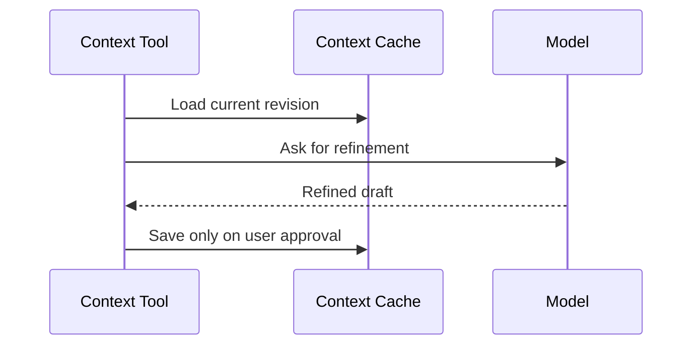

# Refine Context

Refine Context cleans up an existing context document while preserving meaning. It is for structure, clarity, and reducing drift.

## User Flow

1. The user opens Refine Context from the chat composer `+` menu, or from the sidebar More tools menu. The sidebar entry opens Chat with Context Refine already active. Signed-out users are routed to login because Context Refine is an account action.
2. The app loads the current context document.
3. The model proposes a refined version.
4. The user previews the result.
5. The user explicitly saves or discards it.

## Technical Architecture

Refine Context should be a typed context operation over the context cache. It should not publish to PFTL automatically. Publishing remains a separate explicit action requiring an unlocked wallet vault.

Relevant code references are `server/repositories/context.js`, `src/features/context/context-publish.js`, and the context editor in `src/main.jsx`.

## Data Model

- Input: current context revision.
- Output: draft revision.
- Save: Postgres current context cache.
- Publish: encrypted IPFS plus PFTL pointer only after user confirmation.

## Diagram

## Failure Modes

- Preserve names, facts, dates, and explicit goals.
- Never save automatically.
- Show diff or preview before overwrite.
