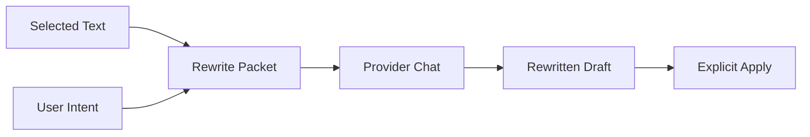

# Rewrite

Rewrite is a general text transformation tool. It should be explicit about source text, requested tone, and destination. It should not silently change context, memory, or task state.

Not Exposed: Rewrite is not available in the current interface. The chat composer and sidebar tool menus do not include a Rewrite entry. This page records the intended design for when it ships.

## User Flow

1. The user selects or provides text.
2. The user chooses or describes a rewrite intent.
3. The model returns rewritten text.
4. The user copies, inserts, or discards the result.

## Technical Architecture

Rewrite should share the chat provider router in `server/chat-router.js`. There is no Rewrite entry in the current tool menus in `src/main.jsx`; the tool was intentionally left out until it has a production-quality flow. A production implementation should pass a structured tool packet rather than relying on ad hoc prompt text.

## Data Model

- Input text may come from chat, context, or a task submission draft.
- Output should be a draft unless the user explicitly applies it.
- Applied output should persist through the owning surface, such as context cache or chat message edit.

## Diagram

## Failure Modes

- Do not overwrite the source automatically.
- Preserve facts unless the user asks for creative rewriting.
- Make long output scrollable and copyable.
