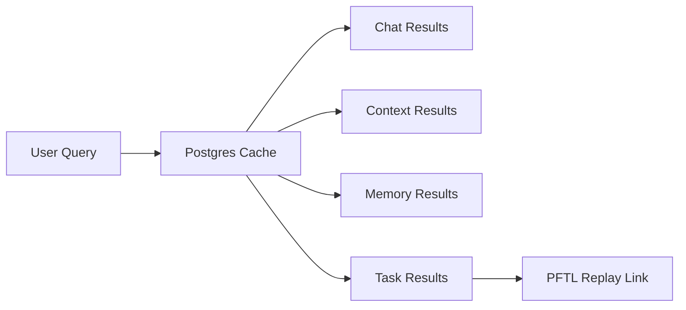

# Search

Search is the retrieval surface for prior chats, memory, context, and eventually chain-backed task history. The product goal is to let a user find prior work without remembering which surface produced it.

## User Flow

1. The user opens Search from the sidebar.
2. The query runs against local product caches first.
3. Results show the source surface, title, date, and short excerpt.
4. Selecting a result opens the relevant chat, context revision, memory entry, or task.

## Technical Architecture

Current implementation is partial. The sidebar entry exists in `src/main.jsx`. Search helpers live in `server/chat-search-tools.js`. The correct architecture is a Postgres-first cache query over chat messages, memory rows, context revisions, and task wrapper rows, with chain replay available for task audit.

Future semantic search should use `pgvector` over cached chat and context material. It should not use PFTL RPC hydration as the default request path.

## Data Model

- Chat search should read from conversation and message tables.
- Memory search should read from chat memory tables.
- Context search should read from the context cache.
- Task search should read from a task cache table and expose PFTL pointer IDs.

## Diagram

## Failure Modes

- If semantic search is unavailable, exact search should still work.
- If task cache is stale, the result should say so and allow replay.
- Search should not block the app on a production RPC scan.

## Reviewer To Do List

Review implementation against this document (search). Mark each item when verified.

### Memory Efficiency
- [ ] List and detail views read Postgres caches with documented caps or pagination.
- [ ] Async workers handle heavy model/IPFS work; primary UX path stays non-blocking.
- [ ] Search queries Postgres caches with limits; no full-table scans without indexes.
- [ ] Future pgvector path must use top-k retrieval, not load entire corpus.

### Code Quality
- [ ] Code references in doc resolve to existing modules and routes.
- [ ] Failure modes documented here have matching user-visible error handling.
- [ ] Partial implementation honestly labeled; no fake semantic search claims.

### Coherence
- [ ] Surface behavior matches Architecture docs for cache vs canonical state.
- [ ] Hidden/not-exposed features labeled honestly if mentioned.
- [ ] Search scope matches indexed sources (chat, context, memory) documented here.

### Bloat
- [ ] Surface does not duplicate logic owned by shared modules or workers.
- [ ] UI state not duplicated in unrelated caches without invalidation rules.
- [ ] Results dedupe across tables; avoid returning duplicate chat + memory hits for same content.

### Security
- [ ] Account scoping enforced on all read/write API paths for this surface.
- [ ] Wallet-bound actions require linked unlocked wallet as documented.
- [ ] Search results account-scoped; no cross-tenant leakage.
