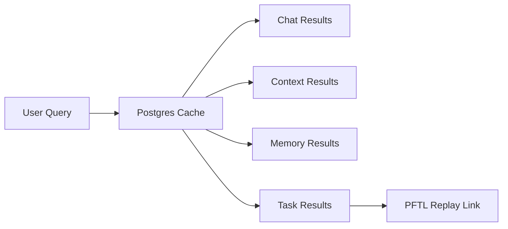

# Search

Search is the retrieval surface for prior chats, memory, context, and eventually chain-backed task history. The product goal is to let a user find prior work without remembering which surface produced it.

## User Flow

1. The user opens Search from the sidebar.
2. The query runs against local product caches first.
3. Results show the source surface, title, date, and short excerpt.
4. Selecting a result opens the relevant chat, context revision, memory entry, or task.

## Technical Architecture

Current implementation covers chat. The sidebar `Search chats` entry in `src/main.jsx` opens `src/features/chat/ChatSearchModal.jsx`, which calls `GET /api/chat/search` backed by `searchChatConversations` in `server/repositories/chat-conversations.js`. That query is a Postgres cache search over conversation titles and message content, account-scoped to the session and limited to active conversations; see the Chat surface doc for details. Web-search pricing helpers (a different concern) live in `server/chat-search-tools.js`. The target architecture extends the same Postgres-first cache query to memory rows, context revisions, and task wrapper rows, with chain replay available for task audit.

Future semantic search should use `pgvector` over cached chat and context material. It should not use PFTL RPC hydration as the default request path.

## Data Model

- Chat search should read from conversation and message tables.
- Memory search should read from chat memory tables.
- Context search should read from the context cache.
- Task search should read from a task cache table and expose PFTL pointer IDs.

## Diagram

## Failure Modes

- If semantic search is unavailable, exact search should still work.
- If task cache is stale, the result should say so and allow replay.
- Search should not block the app on a production RPC scan.
