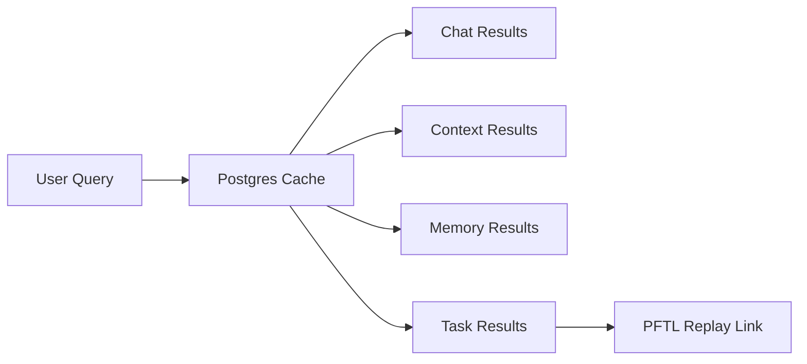

# Search

Search is the retrieval surface for prior chats, memory, context, and eventually chain-backed task history. The product goal is to let a user find prior work without remembering which surface produced it.

## User Flow

Current implementation (chat only):

1. The user clicks the `Search chats` button in the primary sidebar. This opens a modal, not a separate full-screen Search view.
2. The user types at least two characters. The query runs against the Postgres chat cache (and local recent-chat titles).
3. Results show the conversation title and a short matching excerpt, with the matched text highlighted. Hive Chat results carry a network icon; ordinary chats carry a message icon.
4. Selecting a result opens that chat conversation. `Enter` opens the first result.

Search requires a signed-in account. While signed out, the modal shows `Sign in to search your chats.`

Target flow (not yet implemented): a single query that also returns context revisions, memory entries, and task records, each opening the relevant surface.

## Technical Architecture

Current implementation covers chat only. The sidebar `Search chats` button in `src/main.jsx` opens `src/features/chat/ChatSearchModal.jsx`, which debounces input and calls `GET /api/chat/search` backed by `searchChatConversations` in `server/repositories/chat-conversations.js`. That query is a Postgres cache search over conversation titles and message content, account-scoped to the session and limited to active (non-archived) conversations; see the Chat surface doc for details. Title matches and per-conversation message matches are merged by conversation id. Web-search pricing helpers (a different concern) live in `server/chat-search-tools.js`. The target architecture extends the same Postgres-first cache query to memory rows, context revisions, and task wrapper rows, with chain replay available for task audit.

Future semantic search should use `pgvector` over cached chat and context material. It should not use PFTL RPC hydration as the default request path.

## Current Limits

- `GET /api/chat/search` requires a signed-in session and is rate limited to 30 requests per minute (`server/route-policies.js`).
- Queries are normalized to single-spaced text and capped at 200 characters; queries under 2 characters return no results.
- Results default to 20 conversations and cap at 50; matching is exact substring (`ILIKE`), not semantic.
- Only the Chat path is live. Memory, context, and task search are target architecture, not current behavior.

## Data Model

- Chat search should read from conversation and message tables.
- Memory search should read from chat memory tables.
- Context search should read from the context cache.
- Task search should read from a task cache table and expose PFTL pointer IDs.

## Diagram

The diagram shows the target cross-surface shape; only the Chat path is live today.

## Failure Modes

- If semantic search is unavailable, exact search should still work.
- If task cache is stale, the result should say so and allow replay.
- Search should not block the app on a production RPC scan.
