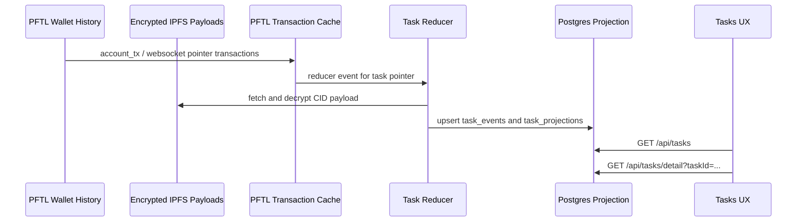

# Tasks

Tasks are wallet-backed work objects. The UX is a fast Postgres projection over PFTL pointer history and encrypted IPFS payloads. PFTL/IPFS is the canonical record; Postgres is the read model that lets the app render task queues, detail pages, forensics, chat context, and reward status without scanning wallet history on every page load.

## What The User Sees

The Tasks surface is reached from the left navigation. It shows a compact task queue with four tabs:

| Tab | Meaning | Cap |
| --- | --- | --- |
| Outstanding | Proposed, accepted, or initially submitted tasks that still require user action. | No cap. Active work must not disappear. |
| Verification | Tasks with a verification request or verification response waiting for authority review. | No cap. Active work must not disappear. |
| Refused | Rejected, refused, expired, or cancelled tasks. | UI may paginate later; chat context currently caps refused history at 10. |
| Rewarded | Tasks that reached a reward decision or reward payment state. | UI may paginate later; chat context currently caps rewarded history at 12. |

The top summary shows outstanding count, PFT in flight, chain-indexed projection count, and active request count. Deadlines render as calendar dates, such as `May 20`, while real event and review timestamps render with time and timezone. This prevents date-only deadlines from showing as misleading `12:00 AM` event times.

The `Request task` button opens a modal where the user can describe the kind of work they want. Submitting the modal uses `POST /api/tasks/request` to build a request bundle from the current context document, deep memory, recent memory, recent chats, and existing task queue; encrypt the bundle locally in the browser; pin it to IPFS; encrypt a `pf.task.request.v1` event that points at that bundle; and sign a PFTL `TASK` pointer transaction from the linked user wallet.

After a successful chain submit, the server records a durable `task_requests` row plus the hidden `pf.task.request_intent.v1` chat turn tagged as `source: task_interface` and `status: pftl_request_published`. The Tasks page only shows a compact in-flight request strip while a request is actively signing, queued, generating, recently published, or recently failed. Once a request becomes a proposed task, the request receipt leaves the main UX and the user should interact with the projected task card instead. Chat also supports task request mode from the `+` menu. It uses the same signed request publisher, tags the cache entry as `source: user_chat`, and keeps the receipt in the active chat thread.

A signed request is not the same thing as a proposed task card. Durable task cards appear after `server/task-generation-worker.js` claims the `task_requests` row, decrypts the request bundle, calls the task-generation prompt/model, emits an encrypted `pf.task.offer.v1` pointer from the authority wallet, syncs PFTL, and the reducer projects the offer into `task_projections`.

When a browser request publish succeeds, `POST /api/tasks/request` records the durable row and immediately schedules a one-shot generation tick. The periodic worker remains as a backstop, but the normal browser path does not wait for the next polling interval before generation starts. The Tasks page refreshes while a request is in flight so a queued receipt is replaced by the projected task card as soon as the offer pointer is indexed.

Clicking a task opens a full-screen task detail surface with three tabs:

| Detail tab | Purpose |
| --- | --- |
| Overview | Human-readable task contract, current status, reward outcome, and stop action when the task is not terminal. |
| Submit | One signed evidence path containing up to two evidence artifacts. The browser encrypts the evidence locally, pins it to IPFS, and signs a PFTL `TASK_SUBMISSION` pointer from the linked wallet. |
| Forensics | Chain audit view: pointer transactions, CIDs, decrypted payload fields, raw payload, and replay integrity. |

## Current Task Detail Behavior

The detail header always shows:

- task title;
- full task ID;
- status;
- deadline, formatted as a date-only value when the protocol field is a calendar deadline;
- displayed reward;
- indexed event count.

The Overview tab renders the task description, steps, verification requirement, and any reward decision. If a task has a `pf.task.reward_decision.v1` event with `reward_pft: 0`, the page shows `No PFT paid` and explains that no separate reward payment pointer is expected. The detailed reason and feedback are not hard-coded. They are read from the reward decision payload:

- `score.decision`;
- `score.reward_pft`;
- `score.completion`;
- `score.evidence_quality`;
- `score.reason`;
- `score.user_feedback`.

If the authority decision is positive but the matching `pf.reward.v1` payment event is not indexed yet, the page should show that the reward decision exists but payment is pending.

## Refuse And Cancel

Users must be able to stop a task even after it has entered the verification loop. The UI action depends on the current task state:

| State | UX action | PFTL transition |
| --- | --- | --- |
| Proposed | Refuse task | `refused` |
| Accepted, submitted, verification requested, awaiting review | Cancel task | `cancelled` |
| Refused, cancelled, expired, rewarded | No stop action | Terminal state. |

The stop action is shown on the Overview tab. If the local seed vault is locked, clicking the action opens the shared wallet unlock flow. If the vault is unlocked, the browser builds an encrypted `pf.task.update.v1` payload and signs a PFTL `TASK_UPDATE` pointer transaction from the linked user wallet.

The seed never leaves the browser. The server only receives:

- encrypted IPFS payload;
- prepared transaction request;
- signed transaction blob;
- task ID and action metadata.

After submission, the server does a best-effort wallet sync and reducer pass so the task projection updates from the chain cache. The UI should still treat PFTL confirmation and reducer projection as asynchronous.

## Evidence And Review

The Submit tab has one primary button: `Submit evidence`. A user can include one or two artifacts in the same signed packet, which covers common verification asks such as text plus screenshot or code plus terminal output. The second artifact is opt-in through `Add evidence`; new tasks and new submission phases start with one empty artifact so stale draft fields do not carry from initial submission into verification response. The flow does not create a local-only evidence packet. The browser route is:

1. For screenshot evidence, the browser reads the selected image and calls `POST /api/tasks/submission` with `phase: process_evidence`.
2. The server uses `prompts/task_engine/evidence_screenshot_read_v1.md` with OpenAI vision to extract visible proof text. The raw screenshot bytes are not placed in the final PFTL evidence payload.
3. `POST /api/tasks/submission` configures the task, confirms the current state accepts evidence, and returns the Task Node encryption pubkey.
4. The browser builds `pf.task.submission.v1` for initial evidence or `pf.task.verification_response.v1` for verification evidence. The payload includes `evidence_items` with a maximum of two compact artifacts. If two artifacts are present, the top-level `artifact_type` is `mixed`; each item keeps its own type, value, file metadata, SHA-256, extracted text or screenshot description, and processing metadata. It does not embed raw base64 media.
5. The browser encrypts the compact payload to the user key and Task Node key.
6. `POST /api/tasks/submission` pins the encrypted payload and prepares a PFTL pointer transaction.
7. The unlocked wallet signs locally.
8. The server submits the signed transaction and returns the tx hash as soon as PFTL accepts it.
9. Wallet sync and reducer projection are scheduled asynchronously. The UI should show the publish result immediately, then refresh task state as indexing catches up.

The task detail modal keeps its own local detail state while it is open. After a successful evidence transaction, the modal updates optimistically to `Submitted` or `Awaiting review` and polls task detail for the submitted transaction hash so the user is not left looking at the old prompt while indexing catches up.

The Tasks page refresh policy is driven by the shared lifecycle contract in `shared/task-lifecycle.js` and the server metadata returned by `GET /api/tasks`. Initial submissions can be advanced by the review worker into `Verification requested`; verification responses can be advanced into `Rewarded` after the authority scores the evidence and, when positive, publishes the reward payment. The list and tab counts should therefore follow the projection cache without a manual browser reload.

Task product flags such as personal/network/alpha task enablement and daily reward cap are read from `server/task-product-config.js`, not embedded in the empty task state.

Accepted tasks accept initial evidence. Verification-requested tasks accept verification evidence. Proposed tasks must be accepted or refused before evidence can be submitted.

The IPFS payload limit is intentionally small enough to catch bad evidence architecture. Large binary evidence should be processed or referenced, not embedded directly in encrypted JSON. Screenshot submissions therefore carry a human-readable vision description plus file digest metadata; the digest proves which local file was processed, while the description gives the verifier useful content.

`server/task-review-worker.js` handles the authority side of the loop:

- submitted tasks are scored for a follow-up verification request using `prompts/task_engine/verification_request_v1.md`; multi-artifact submissions are expanded into separate processed evidence entries before the prompt call;
- the worker publishes a `pf.task.update.v1` pointer with `transition: verification_requested`;
- verification responses are scored using `prompts/task_engine/reward_scoring_v1.md`;
- the worker publishes `pf.task.reward_decision.v1`;
- if the model returns a positive reward, the reward wallet publishes `pf.reward.v1` and transfers PFT;
- if the model returns zero, the task is terminal `rewarded` with `0 PFT` and no payment pointer is expected.

The browser path has now exercised zero, partial, and positive reward outcomes. The task projection treats each as terminal `rewarded`; the reward panel explains whether a separate `pf.reward.v1` payment pointer exists.

## Forensics

Forensics is the audit page for a task ID. It is intended to answer "what happened, where is the evidence, and what was actually indexed?"

Each row represents an indexed PFTL pointer event. The important proof anchors are:

- CID;
- transaction hash;
- ledger index;
- memo index;
- event digest;
- pointer kind;
- schema.

When the Task Node service key can decrypt the IPFS payload, the app expands the row with readable fields. For example:

- `pf.task.offer.v1`: proposed task content, request refs, reward offer, submission requirement.
- `pf.task.update.v1`: lifecycle transition such as accepted, refused, cancelled, or verification requested.
- `pf.task.submission.v1`: initial evidence packet, evidence refs, processed artifacts.
- `pf.task.verification_response.v1`: user's response to the verification request.
- `pf.task.reward_decision.v1`: authority scoring decision, reason, feedback, reward amount.
- `pf.reward.v1`: reward payment pointer/payment evidence.

The raw payload is kept collapsible below the readable fields so operators can audit exact schemas without losing the user-facing explanation.

## State Machine

`Rewarded` does not necessarily mean a positive PFT payment. It means the task reached a terminal reward decision or reward payment state. A rewarded task can correctly show `0 PFT` when the authority decision rejects the evidence or assigns no reward.

## Data Flow

The app should never invent a task card. Durable task cards come from `task_projections`, which is rebuildable from cached PFTL pointer rows plus IPFS payloads.

## API And Code References

| Surface | Code |
| --- | --- |
| Task list and detail modal | `src/main.jsx`, `src/features/tasks/TaskDetailModal.jsx` |
| Browser task action signing | `src/features/tasks/task-actions.js` |
| Browser task request signing | `src/features/tasks/task-request-actions.js` |
| Browser task evidence signing | `src/features/tasks/task-submission-actions.js` |
| Task detail modal, wallet unlock overlay, and evidence drafts | `src/features/tasks/TaskDetailModal.jsx` |
| Screenshot evidence extraction | `server/task-evidence-processing.js`, `prompts/task_engine/evidence_screenshot_read_v1.md` |
| Evidence item summaries | `server/task-evidence-summary.js` |
| Active task request strip | `src/features/tasks/TaskRequestQueue.jsx` |
| Task read routes | `server/task-routes.js` |
| Task action route | `server/task-actions.js` |
| Task submission route | `server/task-submission.js` |
| Task request route | `server/task-request.js` |
| Task request repository | `server/repositories/task-requests.js` |
| Task product configuration | `server/task-product-config.js` |
| Task offer worker | `server/task-generation-worker.js` |
| Task review and reward worker | `server/task-review-worker.js` |
| Task projection repository | `server/repositories/tasks.js` |
| Stop-action policy | `server/task-lifecycle-policy.js` |
| Reward outcome derivation | `server/task-reward-outcome.js` |
| Forensics event meanings | `server/task-event-meaning.js` |
| Encrypted payload hydration | `server/task-payloads.js` |
| PFTL pointer construction | `server/pftl-pointer.js` |
| PFTL submit helper | `server/pftl-submit.js` |
| Cache reducer | `server/pftl-cache-reducer.js` |
| Chat task context | `server/chat-task-context.js` |
| Shared task lifecycle contract | `shared/task-lifecycle.js` |
| Shared task time formatting | `shared/task-time-format.js` |
| Python reference lifecycle | `reference_clients/python/tasknode_pftl/` |

Endpoints:

| Endpoint | Purpose |
| --- | --- |
| `GET /api/tasks` | Returns the current task projection buckets for the linked wallet. |
| `GET /api/tasks/requests` | Returns durable request rows for the linked account and wallet; the frontend only renders active in-flight rows. |
| `GET /api/tasks/detail?taskId=...` | Returns task detail, actions, reward outcome, submission summaries, wallets, and forensics. |
| `POST /api/tasks/action` | Configures, prepares, or submits signed lifecycle updates such as refuse/cancel. |
| `POST /api/tasks/submission` | Configures, prepares, or submits signed initial evidence and verification evidence. |
| `POST /api/tasks/request` | Configures, pins, prepares, or submits a signed on-chain task request. |
| `POST /api/tasks/request-intent` | Records the hidden app-side task request cache entry after chain submit, and records chat-sourced request mode turns. |

## Timestamp Rules

Task date/time rendering uses `shared/task-time-format.js`.

| Field kind | Rendering rule | Example |
| --- | --- | --- |
| Calendar deadline | If the ISO value is midnight UTC, show date only. | `2026-05-20T00:00:00.000Z` -> `May 20` |
| Real event timestamp | Show date, time, and timezone. | `2026-05-19T17:48:00.000Z` -> `May 19, 5:48 PM UTC` |
| Relative list freshness | Use the projection `updated_at` or `last_event_at` display. | `2h ago`, `just now` |

This distinction matters because task deadlines are often date-only commitments while PFTL events are exact transaction history.

## Database Tables

Tasks currently rely on the PFTL cache and projection tables:

| Table | Role |
| --- | --- |
| `task_requests` | Durable request receipt and task-generation worker claim table. Proposed/completed receipts are not shown as primary task UX. |
| `pftl_transactions` | Raw wallet transaction mirror. |
| `pftl_wallet_transactions` | Wallet-scoped transaction feed used by Wallet and cache consumers. |
| `pftl_pointer_memos` | Decoded pointer memos with kind, CID, task ID, context ID, and memo index. |
| `pftl_cache_reducer_events` | Idempotent queue that tells reducers which pointer rows need projection work. |
| `pftl_task_pointer_events` | Task pointer events grouped by task ID, wallet, CID, tx hash, ledger, and schema. |
| `task_events` | Normalized task lifecycle events for replay and forensics. |
| `task_projections` | Current task read model used by the Tasks page and chat task context. |
| `pftl_task_sync_runs` | Replay/import diagnostics. |

The database is allowed to make task reads fast. It is not allowed to become the canonical task source.

## Chat Context

Chat receives task context through `server/chat-task-context.js`. The context is read-only and grouped as:

- Outstanding;
- Pending Verification;
- Refused;
- Rewarded.

Outstanding and pending verification tasks are uncapped in chat context. Refused history is capped at 10 and rewarded history is capped at 12. Chat can reason about task state, but it cannot claim a task changed unless a real task action or chain event occurred.

## Current Limits

- Browser task request publishing is live for the Tasks modal and chat request mode.
- The local Docker API starts `server/task-generation-worker.js`, which claims `task_requests` rows and emits real `pf.task.offer.v1` pointers. Browser publishes also schedule an immediate generation tick; the 5 second worker interval is the backstop. Production should keep this controlled by `TASKNODE_TASK_GENERATION_WORKER_ENABLED`.
- Browser accept/refuse/cancel task updates are live through `POST /api/tasks/action`.
- Browser evidence and verification-response submission are live through `POST /api/tasks/submission`, including up to two compact artifacts in one signed packet.
- The local Docker API starts `server/task-review-worker.js`, controlled by `TASKNODE_TASK_REVIEW_WORKER_ENABLED`. It publishes verification requests, reward decisions, and positive reward payments from configured service/reward seeds.
- Positive reward, partial reward, and zero-reward browser paths have been exercised against projected tasks.
- Allocation wallet provisioning is still seed-config based. Per-user or per-shard allocation wallet provisioning is not implemented.
- Worker failure state is not yet a full user-facing retry panel. Errors are retained in request rows, projection worker metadata, and logs.
- The UI is cache-backed. If the chain cache is stale, the task detail may lag until wallet sync and reducer processing catch up.

## Verification Checklist

When changing Tasks, verify:

1. `GET /api/tasks` returns the expected bucket for the linked wallet.
2. `GET /api/tasks/detail?taskId=...` includes `actions`, `forensics.timeline`, and any `rewardOutcome`.
3. Non-terminal verification-loop tasks expose `canCancel: true`.
4. Terminal tasks do not expose stop actions.
5. Zero-reward tasks explain the reason from `pf.task.reward_decision.v1`.
6. Forensics rows show CIDs, transaction hashes, schema, and decrypted payload details when the service key can read them.
7. Chat task context still treats task state as read-only projection data.
8. Task deadlines render without `12:00 AM`, while real event rows still show exact times.
9. A new verification response draft starts with one empty evidence artifact unless the user explicitly adds a second artifact.
