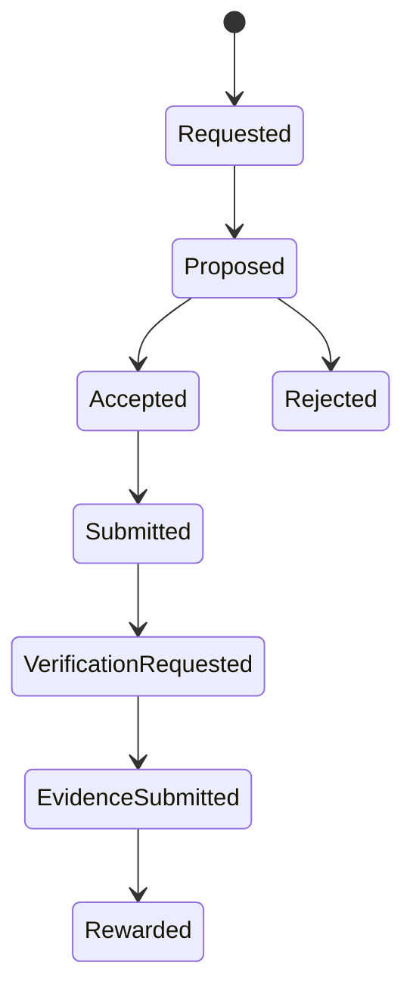

# Tasks

Tasks are portable work objects. The long-term product direction is that task lifecycle state can be replayed from PFTL pointers and encrypted IPFS payloads without trusting the app database.

## User Flow

1. A user requests a task with a context block, or the system issues a task without a direct request.
2. The task is proposed.
3. The user accepts or rejects it.
4. Accepted tasks move onto the user's plate.
5. The user submits the required work product.
6. The system processes the submission and asks for verification evidence.
7. The user submits evidence.
8. The system verifies and issues an on-chain reward.

## Technical Architecture

The current product task surface is in `src/main.jsx`. The protocol specification is `docs/PFTL_TASK_ENGINE_SPEC.md`. The live Python replay reference is under `reference_clients/python/tasknode_pftl/scenarios/`.

The database should cache task envelopes, status projections, display titles, due dates, reward amounts, and verification requirements. It should not be the canonical task state machine.

## Data Model

- Canonical task lifecycle: PFTL pointer events.
- Private task content: encrypted IPFS payloads.
- Fast product cache: Postgres task projection.
- Reward transaction: PFTL payment from the appropriate reward wallet.

## Diagram

## Failure Modes

- A wallet is required for task acceptance, submission, verification, and reward.
- A missing IPFS payload should not erase the pointer event.
- A stale Postgres projection should be repairable by replaying wallet history.

