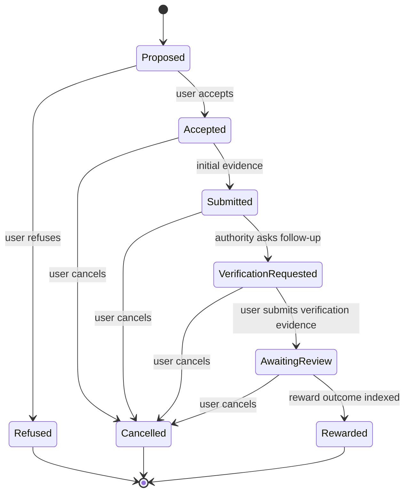
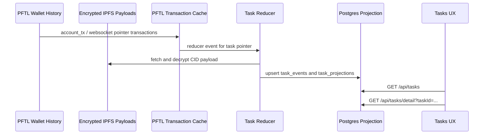

# Tasks

Tasks are wallet-backed work objects. The UX is a fast Postgres projection over PFTL pointer history and encrypted IPFS payloads. PFTL/IPFS is the canonical record; Postgres is the read model that lets the app render task queues, detail pages, forensics, chat context, and reward status without scanning wallet history on every page load.

This page and `Architecture -> Task Async Engine` are the current product
contract for the app-backed task lifecycle. Historical task implementation
plans have been folded into the current surface and architecture docs.

## What The User Sees

The Tasks surface is reached from the left navigation. It shows a compact task queue with four tabs:

| Tab | Meaning | Cap |
| --- | --- | --- |
| Outstanding | Proposed, accepted, or initially submitted tasks that still require user action. | No cap. Active work must not disappear. |
| Verification | Tasks with a verification request or verification response waiting for authority review. | No cap. Active work must not disappear. |
| Refused | Rejected, refused, expired, or cancelled tasks. | UI may paginate later; chat context currently caps refused history at 10. |
| Rewarded | Tasks that reached a terminal reward outcome. | UI may paginate later; chat context currently caps rewarded history at 12. |

The top summary shows outstanding count, PFT in flight, chain-indexed projection count, and active request count. Deadlines render as calendar dates, such as `May 20`, while real event and review timestamps render with time and timezone. This prevents date-only deadlines from showing as misleading `12:00 AM` event times.

`GET /api/tasks` also returns task sync integrity from the cache layer. The sync status can be `ready`, `empty`, `indexing_lag`, or `reducer_attention`. `indexing_lag` means the cache has a newer task pointer than the projected row has consumed. `reducer_attention` means failed reducer work exists for one or more visible tasks. The UI should treat these as indexing states, not as final lifecycle states.

Network-pushed work appears in the same task queue, not in a separate lifecycle. Visible task labels are intentionally limited to `Personal`, `Network`, or `Alpha`; implementation categories such as engineering are not shown as task types. Project/routing metadata stays in the backing payload and forensics, while the list and detail page focus on the normal task lifecycle: accept or refuse, submit, verify, reward, and audit.

`Request task` is not the Network Task entry point. `Request task` creates a user-requested personal task proposal. Network Tasks are system-routed by Hive Board Manager when an active network project needs work and an eligible candidate is available.

The user-facing routing gates are:

1. Signed-in Task Node account.
2. Linked PFT wallet.
3. Linked wallet indexed as an active user wallet in the PFTL sync cache.
4. Completed Network Diagnostic Report from Memory.
5. No outstanding or pending Network Task already consuming that account/wallet's Network Task capacity.
6. Hive Board Manager finds a project need that matches the routing profile.

Personal, engineering, proposed, refused, and rewarded non-network tasks can inform routing judgment, but they do not hard-block Network Task eligibility. When these gates are satisfied, the user is ready to receive a Network Task but still waits for Board Manager to choose them for a live project need.

Once an account has at least two positive task rewards, Task Node automatically queues the Network Diagnostic Report job from the task projection/reward path and from the memory worker backfill. The user should not need to open Memory or click refresh for the report to be generated.

## List And Detail State Consistency

The task list, tab counts, and task detail page must agree because they read the same projected lifecycle. If the detail page says a task is rewarded, the list must not keep showing that task under Verification.

Refresh failures must be treated as state-boundary bugs, not one-off task records. A task can be visibly stale while the database projection, chain cache, or reducer is still catching up. The Tasks page must keep refreshing when either the lifecycle itself is active or the sync metadata says the projection is behind cached pointers.

The repair belongs in the shared lifecycle and sync contract, not a hard-coded task patch. `shared/task-lifecycle.js` marks review-loop states such as `verification_requested` as refreshable and also accepts a projection-refresh flag for `indexing_lag`. `GET /api/tasks` uses that contract when returning sync metadata, and the Tasks page uses the metadata to keep polling until the projection catches up or reaches a terminal state such as `rewarded`, `refused`, or `cancelled`.

In plain English:

1. A task card can sit in Verification while the system is waiting for evidence or review.
2. While it is in that review loop, the list keeps checking the projection cache.
3. If the cache has a newer task pointer than the projected row, the list keeps checking even if the visible task is still Proposed.
4. Terminal states stop active refresh because no later lifecycle event is expected for the normal task loop.

Regression coverage lives in `scripts/task-lifecycle-smoke.mjs`. It asserts that `verification_requested` stays refreshable, that projection lag keeps a proposed task polling, and that terminal `rewarded` tasks do not keep the page polling forever.

The `Request task` button opens a modal where the user can describe the kind of work they want. Submitting the modal uses `POST /api/tasks/request` to build a request bundle from the current context document, deep memory, recent memory, recent chats, and existing task queue; encrypt the bundle locally in the browser; pin it to IPFS; encrypt a `pf.task.request.v1` event that points at that bundle; and sign a PFTL `TASK` pointer transaction from the linked user wallet.

After a successful chain submit, the server records a durable `task_requests` row plus the hidden `pf.task.request_intent.v1` chat turn tagged as `source: task_interface` and `status: pftl_request_published`. The Tasks page only shows a compact in-flight request strip while a user request is actively signing, queued, generating, recently published, or recently failed. Operator-only Network Task repair rows are audit records, not user requests, and must not appear as `Needs attention` or count as requests processing. Once a request becomes a proposed task, the request receipt leaves the main UX and the user should interact with the projected task card instead. Chat also supports task request mode from the `+` menu. It uses the same signed request publisher, tags the cache entry as `source: user_chat`, and keeps the receipt in the active chat thread.

A signed request is not the same thing as a proposed task card. Durable task cards appear after `server/task-generation-worker.js` claims the `task_requests` row, decrypts the request bundle, calls the task-generation prompt/model, emits an encrypted `pf.task.offer.v1` pointer from the authority wallet, syncs PFTL, and the reducer projects the offer into `task_projections`.

On Fly, task generation and review both depend on the `worker` process group.
Deploys must use `npm run fly:deploy`, which runs `npm run fly:background-guard`
after the image rollout. If request receipts remain queued, offers do not
appear, or submitted tasks do not advance to `Verification requested`, verify
the active Fly `worker` is `started` before treating task data as corrupt.

## Operator Query: User Task Pipeline

When a user says a requested task is missing, do not wait for the UI or infer
from chat state. Query the request/projection pipeline immediately. The fastest
production command is:

```bash
fly ssh console -a tasknodeofficial-dev --process-group app -C 'node scripts/query-user-tasks.mjs --handle goodalexander'
```

Use `--handle`, `--account-id`, or `--wallet`. The script resolves the runtime
account and linked wallet, then reads:

- `task_requests`: signed request receipt and task-generation worker status;
- `task_projections`: visible task cards backing `GET /api/tasks`;
- `pftl_pointer_observations`: cached PFTL task pointers seen by tracked wallets;
- `pftl_cache_reducer_events`: pending, completed, or failed projection work;
- `pftl_task_sync_runs`: recent wallet sync/replay diagnostics.

Interpretation:

| Script field | Meaning |
| --- | --- |
| `latestRequestStatus` | Request worker state. `published` or `queued` means waiting for the task-generation worker; `generating` means claimed; `proposed` means the worker published an offer. |
| `generatedTaskId` | The concrete task ID created by `server/task-generation-worker.js`. |
| `visibleProjection` | Whether `task_projections` already has the generated task. If true, the Tasks UI should be able to show it after refresh. |
| `pendingReducerCount` / `failedReducerCount` | Whether cached pointer projection work is still pending or failed. |
| `lastError` | The request worker or reducer error to inspect first. |

Network Task allocation repairs can leave a `task_requests` receipt for audit, but those rows should be marked with `metadata_json.operator_repair.public_visibility='hidden'` and should not be returned by `GET /api/tasks/requests`. The failed allocation/job is the operator-facing source of truth; the user-facing surface should show the replacement Network Task or no active request strip.

For manual SQL, first resolve the account/wallet from the app runtime store, then
query by `account_id` or `subject_wallet`:

```sql
SELECT request_id, status, generated_task_id, request_bundle_cid,
       request_tx_hash, worker_attempt_count, worker_claimed_at,
       worker_completed_at, last_error, updated_at
FROM task_requests
WHERE account_id = '<account_id>' OR subject_wallet = '<wallet_address>'
ORDER BY updated_at DESC
LIMIT 20;

SELECT task_id, status, title, request_id, last_event_tx_hash,
       last_event_cid, updated_at
FROM task_projections
WHERE account_id = '<account_id>' OR subject_wallet = '<wallet_address>'
ORDER BY updated_at DESC
LIMIT 20;
```

If `task_requests.status='proposed'` has a `generated_task_id` but
`task_projections` does not contain that task, the failure is projection/indexing,
not task generation. Use the forensics guidance below or
`npm run task-replay-repair -- --task-id=<task_id> --apply`. Do not hand-edit
`task_projections`.

## Task Generation Contract

Generated offers must match the browser UX. The task-generation prompts in
`prompts/task_engine/taskgen_personal_v1.md` and
`prompts/task_engine/taskgen_network_v1.md`, plus worker validation in
`server/task-generation-worker.js`, enforce this contract:

| Contract | Current behavior |
| --- | --- |
| Evidence surfaces | Text, URL, screenshot/image, uploaded file or document, public commit link when explicitly appropriate, or mixed evidence made from those surfaces. |
| Unsupported evidence | Video, screen recording, audio, live calls, calendar invites, or any other proof type the app cannot submit must not be requested. Before/after proof should use screenshots plus text, code excerpt, URL, or file evidence. |
| Step count | New generated tasks must contain 2 to 5 concrete steps. One-step and zero-step generated tasks fail worker validation. |
| Public repository proof | `github_commit` should be used only when the user explicitly provides or requests a public commit or repository evidence path. Private/local work should use screenshot, text, file, or mixed evidence. |
| Plain task speech | Generated task cards must not expose internal compliance shorthand such as conformance, gates, verdicts, priority stacks, or exact-edits rubrics. The worker rejects those cards and retries once with a plain-language repair instruction before failing the request. |
| URL evidence safety | The review worker may extract public URL evidence, but it does not fetch unsupported schemes, credentialed URLs, localhost, private IP ranges, metadata IPs, or DNS names that resolve to private addresses. Redirects are not followed during evidence extraction. |
| Canonical source | The generated task is written into the encrypted `pf.task.offer.v1` IPFS payload and anchored by the authority wallet PFTL pointer. Postgres only projects it for fast reads. |

Network Tasks and Alpha Tasks use the separate network taskgen prompt. The network-task generation worker injects a `network_task` block into the request bundle with project id, task class, routing reason, diagnostic profile digest, and reward band. The Board Manager does not author the concrete task. It queues the allocation and records why the system is routing work to the contributor; `server/task-generation-worker.js` still generates the title, steps, submission requirement, and verification policy.

The network prompt treats generated tasks as coordination units for contributors
who may not know each other. A compliant Network Task should advance Post Fiat,
Task Node, the shared data lake, or collective capital formation while producing
a scoped artifact with reviewable, sybil-resistant proof. The assignment should
translate project or Board Manager shorthand into plain-English work on a named
surface, document, data state, code path, or artifact.

The packet path is Board Manager `payload.network_task` ->
`network_task_allocations` / `network_task_generation_jobs` ->
encrypted `pf.task.request_bundle.v1` with a `pf.hive.network_task_request.v1`
block -> `pf.taskgen.input.v1` -> encrypted `pf.task.offer.v1`. That path keeps
Network Tasks in the normal task lifecycle while preserving the project routing,
candidate fit, reward band, and source payload digest for audit.

After publication, the Board Manager is out of the lifecycle. Status comes from signed PFTL task pointers reduced into `task_projections`. Hive/project rows mirror that status through `syncNetworkTaskProjection`; they do not decide task state.

When a project-linked Network Task reaches `rewarded`, `syncNetworkTaskProjection` schedules a Board Manager follow-up job for two minutes after the reward event. That job is only a Hive board inspection trigger. It is idempotent by task and last reward transaction, and the worker skips it if any Board Manager run has already completed after the reward timestamp.

When a browser request publish succeeds, `POST /api/tasks/request` records the durable row and immediately schedules a one-shot generation tick. The periodic worker remains as a backstop, but the normal browser path does not wait for the next polling interval before generation starts. The Tasks page refreshes while a request is in flight so a queued receipt is replaced by the projected task card as soon as the offer pointer is indexed.

Clicking a task opens a task detail popout with three tabs:

| Detail tab | Purpose |
| --- | --- |
| Overview | Human-readable task contract, current status, reward outcome, and stop action when the task is not terminal. |
| Submit | One signed evidence path containing up to two evidence artifacts. The browser encrypts the evidence locally, pins it to IPFS, and signs a PFTL `TASK_SUBMISSION` pointer from the linked wallet. |
| Forensics | Chain audit view: pointer transactions, CIDs, decrypted payload fields, raw payload, and replay integrity. |

On desktop the task detail covers the Tasks workspace as a smooth in-place pane, not as a separate app screen. The left app shell remains visible so the user keeps their place in the Task Node, and the close pill returns to the task queue. On narrow mobile screens the same detail surface expands to the full viewport because there is not enough horizontal room for a pane.

## Copy Task Flow

Task list rows do not expose copy controls. Clicking a row opens the task detail card, where the user can inspect the task before exporting it.

The task detail header contains a subtle `Copy task brief` action next to the task ID. That action copies a plain-text task brief designed to be pasted into Codex or another external worker. The copied payload includes:

- title;
- task ID and request ID when available;
- kind, status, reward, and deadline;
- objective / description;
- numbered steps;
- verification requirements;
- current verification request when the task is in a follow-up verification loop;
- requested output guidance for the external worker.

The visible task ID remains separately copyable as an explicit ID-level affordance, but it is not the main handoff path. The formatting is produced by `src/features/tasks/task-copy-format.js`, with regression coverage in `scripts/task-copy-payload-smoke.mjs` across accepted, rewarded, and verification-requested task examples.

## Current Task Detail Behavior

The detail header always shows:

- task title;
- full task ID;
- status;
- deadline label and value. Proposed tasks without a work deadline show the
  server-owned `Accept by` window. Accepted tasks do not keep showing that
  accept-by timestamp as a work deadline; if no `deadline_at` exists, they show
  `No deadline`;
- displayed reward;
- indexed event count.

The Overview tab renders the task description, steps, verification requirement, and any reward outcome. Current reward reviews close with one `pf.reward.v1` event. If the payload has `reward_pft: 0`, the page shows `No PFT paid` and explains that the one-drop transaction is only the encrypted outcome carrier, not an economic reward. The detailed reason and feedback are not hard-coded. They are read from the reward payload:

- `score.decision`;
- `score.reward_pft`;
- `score.completion`;
- `score.evidence_quality`;
- `score.reason`;
- `score.user_feedback`.

Task steps come from the decrypted `pf.task.offer.v1` payload. The reducer preserves those steps in `task_projections.metadata_json.generatedTask.steps`; the UI must not invent a one-step list from the submission requirement when real generated steps exist.

## Refuse And Cancel

Users must be able to stop a task even after it has entered the verification loop. The UI action depends on the current task state:

| State | UX action | PFTL transition |
| --- | --- | --- |
| Proposed | Refuse task | `refused` |
| Accepted, submitted, verification requested, awaiting review | Cancel task | `cancelled` |
| Refused, cancelled, expired, rewarded | No stop action | Terminal state. |

The stop action is shown on the Overview tab. Proposed tasks show both `Accept task` and `Refuse task`; accepted or review-loop tasks show the relevant cancel action. If the local seed vault is locked, clicking the action opens the shared wallet unlock flow. If the vault is unlocked, the browser builds an encrypted `pf.task.update.v1` payload and signs a PFTL `TASK_UPDATE` pointer transaction from the linked user wallet.

The seed never leaves the browser. The server only receives:

- encrypted IPFS payload;
- prepared transaction request;
- signed transaction blob;
- task ID and action metadata.

After submission, the server does a best-effort wallet sync and reducer pass so the task projection updates from the chain cache. The UI should still treat PFTL confirmation and reducer projection as asynchronous.

## Evidence And Review

The Submit tab has one primary button when the current task state accepts evidence: `Submit evidence`. If the task is already `Submitted`, `Awaiting review`, `Rewarded`, or otherwise closed to evidence, the Submit tab shows a read-only state card instead of the evidence form. This prevents the user from seeing an old task prompt while the authority is reviewing an indexed submission.

A user can include one or two artifacts in the same signed packet, which covers common verification asks such as text plus screenshot or code plus terminal output. The second artifact is opt-in through `Add second evidence`; clicking it immediately adds a second draft without requiring Evidence 1 to be filled first. Mixed evidence tasks start with one text draft, and the second draft defaults to screenshot so the user can intentionally build a text-plus-screenshot packet. New tasks and new submission phases start with one empty artifact so stale draft fields do not carry from initial submission into verification response.

Screenshot and file uploads use a Task Node styled picker, not the native browser `Choose File` control. The browser route is:

1. For screenshot evidence, the browser reads the selected image and calls `POST /api/tasks/submission` with `phase: process_evidence`.
2. The server uses `prompts/task_engine/evidence_screenshot_read_v1.md` with OpenAI vision to extract visible proof text. The raw screenshot bytes are not placed in the final PFTL evidence payload.
3. `POST /api/tasks/submission` configures the task, confirms the current state accepts evidence, and returns the Task Node encryption pubkey.
4. The browser builds `pf.task.submission.v1` for initial evidence or `pf.task.verification_response.v1` for verification evidence. The payload includes `evidence_items` with a maximum of two compact artifacts. If two artifacts are present, the top-level `artifact_type` is `mixed`; each item keeps its own type, value, file metadata, SHA-256, extracted text or screenshot description, and processing metadata. It does not embed raw base64 media.
5. The browser encrypts the compact payload to the user key and Task Node key.
6. `POST /api/tasks/submission` pins the encrypted payload and prepares a PFTL pointer transaction.
7. The unlocked wallet signs locally.
8. The server submits the signed transaction and returns the tx hash as soon as PFTL accepts it.
9. Wallet sync and reducer projection are scheduled asynchronously. The UI should show the publish result immediately, then refresh task state as indexing catches up.

The task detail modal keeps its own local detail state while it is open. After a successful evidence transaction, the modal updates optimistically to `Submitted` or `Awaiting review` and polls task detail for the submitted transaction hash so the user is not left looking at the old prompt while indexing catches up.

The Tasks page refresh policy is driven by the shared lifecycle contract in `shared/task-lifecycle.js` and the server metadata returned by `GET /api/tasks`. Initial submissions can be advanced by the review worker into `Verification requested`; verification responses can be advanced into `Rewarded` after the authority scores the evidence and publishes the terminal `pf.reward.v1` outcome. The list and tab counts should therefore follow the projection cache without a manual browser reload.

The review worker is a production dependency, not an optional enhancement. On
Fly it runs under `npm run start:worker`; a passing public `/health` check does
not prove this loop is alive. `npm run fly:worker-guard` is the operator check
for stuck review-loop states.

Task product flags such as personal/network/alpha task enablement and daily reward cap are read from `server/task-product-config.js`, not embedded in the empty task state.

Accepted tasks accept initial evidence. Verification-requested tasks accept verification evidence. Proposed tasks must be accepted or refused before evidence can be submitted.

The IPFS payload limit is intentionally small enough to catch bad evidence architecture. Large binary evidence should be processed or referenced, not embedded directly in encrypted JSON. Screenshot submissions therefore carry a human-readable vision description plus file digest metadata; the digest proves which local file was processed, while the description gives the verifier useful content.

`server/task-review-worker.js` handles the authority side of the loop:

- submitted tasks are scored for a follow-up verification request using `prompts/task_engine/verification_request_v1.md`; multi-artifact submissions are expanded into separate processed evidence entries before the prompt call;
- the worker publishes a `pf.task.update.v1` pointer with `transition: verification_requested`;
- verification responses are scored using `prompts/task_engine/reward_scoring_v1.md`;
- the worker publishes exactly one terminal `pf.reward.v1`;
- if the model returns a positive or partial reward, the `pf.reward.v1` transaction amount is the economic PFT payout;
- if the model returns zero, the `pf.reward.v1` transaction amount is one drop and the payload records `reward_pft: "0.00"` and `economic_reward_pft: "0.00"`.

Worker publication is guarded by `task_review_publications`, keyed by
`(task_id, worker_name)`. Once the worker has a transaction hash or CID for the
verification request or reward outcome, the publication row is
the idempotency record even if the projection has not caught up yet. A stale
processing lease can be retried, but a recorded publication cannot be reclaimed
for a second authority review or reward outcome. This prevents duplicate
verification requests and duplicate reward outcomes during cache or reducer lag.

This lock only protects workers that share the same database. Default local
Docker therefore runs the API as web-only and does not publish task-review
events to the live Fly task universe. Local end-to-end reward tests use
`npm run docker:reward-test`, which generates local-only authority and reward
seeds in `.env.local-rewards` and starts an isolated `reward-test-worker`.

The browser path has now exercised zero, partial, and positive reward outcomes. The task projection treats each as terminal `rewarded`; the reward panel explains whether the `pf.reward.v1` event paid an economic amount or used a one-drop zero-reward carrier.

## Forensics

Forensics is the audit page for a task ID. It is intended to answer "what happened, where is the evidence, and what was actually indexed?"

Each row represents an indexed PFTL pointer event. The important proof anchors are:

- CID;
- transaction hash;
- ledger index;
- memo index;
- event digest;
- pointer kind;
- schema.

When the Task Node service key can decrypt the IPFS payload, the app expands the row with readable fields. For example:

- `pf.task.offer.v1`: proposed task content, request refs, reward offer, submission requirement.
- `pf.task.update.v1`: lifecycle transition such as accepted, refused, cancelled, or verification requested.
- `pf.task.submission.v1`: initial evidence packet, evidence refs, processed artifacts.
- `pf.task.verification_response.v1`: user's response to the verification request.
- `pf.reward.v1`: terminal reward outcome with scorer decision, reason, task history, and economic reward amount.

The raw payload is kept collapsible below the readable fields so operators can audit exact schemas without losing the user-facing explanation.

The detail response includes `forensics.integrity`, which compares the projected task row to the chain-cache inputs:

| Field | Meaning |
| --- | --- |
| `expectedEventCount` | Event count stored on the projection. |
| `pointerEventCount` | Legacy pointer event rows available for the task detail. |
| `reducerEventCount` | Normalized task event rows available for the detail page. |
| `pendingReducerCount`, `processingReducerCount`, `failedReducerCount` | Reducer work still pending, active, or failed for this task. |
| `latestCachedPointer` | Newest cached pointer observation for the task ID across the account's active wallets. |
| `projectionBehindCachedPointer` | True when the cache has a newer tx/CID than `task_projections.last_event_*`. |
| `projectionLastEvent` | Last tx/CID/status/event count currently stored on the projection. |

If `projectionBehindCachedPointer` is true, the task may be waiting on reducer indexing. The correct repair path is `npm run task-replay-repair -- --task-id=<task_id> --apply`, not manual SQL against `task_projections`.

## State Machine



`Rewarded` does not necessarily mean a positive PFT payment. It means the task reached a terminal reward outcome. A rewarded task can correctly show `0 PFT` when the authority review rejects the evidence or assigns no reward.

## Data Flow



The app should never invent a task card. Durable task cards come from `task_projections`, which is rebuildable from cached PFTL pointer rows plus IPFS payloads.

## API And Code References

| Surface | Code |
| --- | --- |
| Task list and detail modal | `src/main.jsx`, `src/features/tasks/TaskDetailModal.jsx` |
| Browser task action signing | `src/features/tasks/task-actions.js` |
| Browser task request signing | `src/features/tasks/task-request-actions.js` |
| Browser task evidence signing | `src/features/tasks/task-submission-actions.js` |
| Task detail modal, wallet unlock overlay, and evidence drafts | `src/features/tasks/TaskDetailModal.jsx` |
| Screenshot evidence extraction | `server/task-evidence-processing.js`, `prompts/task_engine/evidence_screenshot_read_v1.md` |
| Evidence item summaries | `server/task-evidence-summary.js` |
| Active task request strip | `src/features/tasks/TaskRequestQueue.jsx` |
| Task read routes | `server/task-routes.js` |
| Task action route | `server/task-actions.js` |
| Task submission route | `server/task-submission.js` |
| Task request route | `server/task-request.js` |
| Task request repository | `server/repositories/task-requests.js` |
| Network Task allocation repository | `server/repositories/network-tasks.js` |
| Network Task generation worker | `server/network-task-generation-worker.js` |
| Task product configuration | `server/task-product-config.js` |
| Task offer worker | `server/task-generation-worker.js` |
| Task review and reward worker | `server/task-review-worker.js` |
| Task projection repository | `server/repositories/tasks.js` |
| Stop-action policy | `server/task-lifecycle-policy.js` |
| Reward outcome derivation | `server/task-reward-outcome.js` |
| Forensics event meanings | `server/task-event-meaning.js` |
| Encrypted payload hydration | `server/task-payloads.js` |
| PFTL pointer construction | `server/pftl-pointer.js` |
| PFTL submit helper | `server/pftl-submit.js` |
| Cache reducer | `server/pftl-cache-reducer.js` |
| Chat task context | `server/chat-task-context.js` |
| Shared task lifecycle contract | `shared/task-lifecycle.js` |
| Shared task time formatting | `shared/task-time-format.js` |
| Python reference lifecycle | `reference_clients/python/tasknode_pftl/` |

Endpoints:

| Endpoint | Purpose |
| --- | --- |
| `GET /api/tasks` | Returns the current task projection buckets for the linked wallet. |
| `GET /api/tasks/requests` | Returns durable request rows for the linked account and wallet; the frontend only renders active in-flight rows. |
| `GET /api/tasks/detail?taskId=...` | Returns task detail, actions, reward outcome, submission summaries, wallets, and forensics. |
| `POST /api/tasks/action` | Configures, prepares, or submits signed lifecycle updates such as refuse/cancel. |
| `POST /api/tasks/submission` | Configures, prepares, or submits signed initial evidence and verification evidence. |
| `POST /api/tasks/request` | Configures, pins, prepares, or submits a signed on-chain task request. |
| `POST /api/tasks/request-intent` | Records the hidden app-side task request cache entry after chain submit, and records chat-sourced request mode turns. |

## Task Detail UX

The detail modal is state-specific.

When a task is proposed or accepted, the overview shows the original task offer: description, steps, evidence requirement, and any Hive routing context. This helps the user decide what work is being requested.

When a task enters `verification_requested`, the detail view uses the compact verification layout from `mocks/verify.jsx`. The overview shows a short `Original task` summary so the user knows what work the verification belongs to, but the full offer, steps, and Hive routing context stay behind a `Show` toggle. The active `Verification requested` ask appears directly below that summary, followed by a `Respond in Submit` action. Cancel controls stay secondary behind `Cancel task` so they do not compete with the current verification requirement.

The Submit tab repeats the current verification request in a collapsible block, then focuses on the user's response. It starts with one evidence item. A second item appears only when the user clicks `Add second evidence`; mixed evidence requirements do not auto-open a second blank card.

## Timestamp Rules

Task date/time rendering uses `shared/task-time-format.js`.

| Field kind | Rendering rule | Example |
| --- | --- | --- |
| Accept-by window | Proposed tasks show `Accept by` from `accept_by`; it is not a work deadline. | `Accept by Jun 5, 9:14 PM UTC` |
| Work deadline | Use `deadline_at` when present. Accepted tasks with no `deadline_at` show `No deadline`. | `Jun 6` or `No deadline` |
| Calendar deadline | If the ISO value is midnight UTC, show date only. | `2026-05-20T00:00:00.000Z` -> `May 20` |
| Real event timestamp | Show date, time, and timezone. | `2026-05-19T17:48:00.000Z` -> `May 19, 5:48 PM UTC` |
| Relative list freshness | Use the projection `updated_at` or `last_event_at` display. | `2h ago`, `just now` |

This distinction matters because task deadlines are often date-only commitments,
accept-by windows are task-offer decisions, and PFTL events are exact
transaction history.

## Database Tables

Tasks currently rely on the PFTL cache and projection tables:

| Table | Role |
| --- | --- |
| `task_requests` | Durable request receipt and task-generation worker claim table. Proposed/completed receipts are not shown as primary task UX. |
| `network_task_allocations` | Project-linked allocation/routing mirror for system-pushed Network Tasks and Alpha Tasks before/after a concrete task offer exists. After task publication, it follows projection state for load/cadence reads and does not override task state. |
| `network_task_generation_jobs` | Durable worker job that converts a Board Manager allocation into a normal encrypted task request bundle. |
| `network_project_task_refs` | Project/Hive display mirror for tasks. Its `state` is reconciled from `task_projections.status` once a concrete task exists, and Hive derives project task rows, routing feed, allotted operators, and routed PFT from it when explicit rollup tables are empty. |
| `pftl_transactions` | Raw wallet transaction mirror. |
| `pftl_wallet_transactions` | Wallet-scoped transaction feed used by Wallet and cache consumers. |
| `pftl_pointer_memos` | Decoded pointer memos with kind, CID, task ID, context ID, and memo index. |
| `pftl_pointer_observations` | Wallet/account observation bridge used to replay one task across user, authority, and allocation wallets without pretending a pointer memo has a single wallet owner. |
| `pftl_cache_reducer_events` | Idempotent queue that tells reducers which pointer rows need projection work. |
| `pftl_task_pointer_events` | Task pointer events grouped by task ID, wallet, CID, tx hash, ledger, and schema. |
| `task_events` | Normalized task lifecycle events for replay and forensics. |
| `task_projections` | Current task read model used by the Tasks page and chat task context. |
| `pftl_task_sync_runs` | Replay/import diagnostics. |

The database is allowed to make task reads fast. It is not allowed to become the canonical task source.

Task projection replay is account scoped. A single lifecycle can include the user wallet, task authority wallet, and allocation wallet, so the reducer rebuilds a task from cached pointers with the same task ID across the active wallets registered to the account. Blank historical task IDs are not treated as candidates for a known task; only the concrete task ID and the seed CID are replay inputs.

Task projection reducer events are only queued for task-style pointers that carry a task ID. Task request pointers and historical task-looking pointers without a task ID are not projected as task lifecycle rows. This prevents blank historical wallet pointers from creating failed or ambiguous task state.

## Chat Context

Chat receives task context through `server/chat-task-context.js`. The context is read-only and grouped as:

- Outstanding;
- Pending Verification;
- Refused;
- Rewarded.

Outstanding and pending verification tasks are uncapped in chat context. Refused history is capped at 10 and rewarded history is capped at 12. Chat can reason about task state, but it cannot claim a task changed unless a real task action or chain event occurred.

## Current Limits

- Browser task request publishing is live for the Tasks modal and chat request mode.
- Board Manager `initiate_network_task` queueing is implemented. It writes `network_task_allocations` and `network_task_generation_jobs`; fake smoke jobs are marked failed after verification so the live worker does not process test data.
- The API worker starts `server/task-generation-worker.js` when `TASKNODE_TASK_GENERATION_WORKER_ENABLED=true`. It claims `task_requests` rows and emits real `pf.task.offer.v1` pointers. Browser publishes also schedule an immediate generation tick; the 5 second worker interval is the backstop.
- The API worker starts `server/network-task-generation-worker.js` when `TASKNODE_NETWORK_TASK_GENERATION_WORKER_ENABLED=true`. It creates a normal encrypted task request bundle from a queued network allocation and schedules the existing task-generation worker. A queued `network_task_generation_jobs` row is not a visible Network Task until the second worker publishes the offer and `task_projections` contains the task.
- If a Network Task allocation produced the wrong work or its generated task request failed before any offer was published, it should close as an operator-only repair record instead of appearing as `Needs attention`. The task-generation worker automatically closes failed Board Manager-generated requests before offer publication. If automatic repair did not run, use `npm run network-task-allocation-repair -- fail --allocation-id <id> --reason "<reason>" --execute` or `npm run network-task-allocation-repair -- fail --request-id <id> --reason "<reason>" --execute`. This closes the allocation/job/intent chain as failed or stale so it stops consuming candidate capacity. Use `npm run board-manager:manual-network-task -- --project-id <id> --account-id <account> --wallet <wallet> --need "<plain-English task need>" --reason "<routing reason>" --execute` only when an operator needs to route a replacement through the Board Manager action hook.
- Browser accept/refuse/cancel task updates are live through `POST /api/tasks/action`.
- Browser evidence and verification-response submission are live through `POST /api/tasks/submission`, including up to two compact artifacts in one signed packet.
- Default local Docker is web/API only for task review publication: `TASKNODE_PROCESS_ROLE=web` and `TASKNODE_TASK_REVIEW_WORKER_ENABLED=false`. It can inspect and reduce task state, but it must not publish verification requests or reward outcomes to the live Fly task universe.
- Local reward issuance tests use `npm run docker:reward-test`. That profile starts `reward-test-worker` with generated local service, authority, and reward seeds from `.env.local-rewards`. It can publish local task-review/reward events against the local Docker database without sharing production signing authority with Fly.
- The task review worker uses `TASKNODE_TASK_WORKER_CLAIM_STALE_SECONDS` with a 900 second deployment value and a 300 second code floor. Review/scoring can include provider calls, IPFS writes, PFTL publishes, and projection refreshes, so a short stale-claim window can reclaim the same task while the first publish is still settling. Claim queries exclude tasks that already have indexed verification-request or reward-outcome events in `task_events`, the `task_review_publications` lock owns each publication lane, and the worker re-checks the task timeline immediately before publishing verification requests or rewards.
- Positive reward, partial reward, and zero-reward browser paths have been exercised against projected tasks.
- Allocation wallet provisioning is still seed-config based. Per-user or per-shard allocation wallet provisioning is not implemented.
- Worker failure state is not yet a full user-facing retry panel. Errors are retained in request rows, projection worker metadata, and logs.
- The UI is cache-backed. If the chain cache is stale, the task detail may lag until wallet sync and reducer processing catch up.

## Verification Checklist

When changing Tasks, verify:

1. `GET /api/tasks` returns the expected bucket for the linked wallet.
2. `GET /api/tasks/detail?taskId=...` includes `actions`, `forensics.timeline`, and any `rewardOutcome`.
3. Non-terminal verification-loop tasks expose `canCancel: true`.
4. Terminal tasks do not expose stop actions.
5. Zero-reward tasks explain the reason from the terminal `pf.reward.v1` payload.
6. Forensics rows show CIDs, transaction hashes, schema, and decrypted payload details when the service key can read them.
7. Chat task context still treats task state as read-only projection data.
8. Task deadlines render without `12:00 AM`, while real event rows still show exact times.
9. A new verification response draft starts with one empty evidence artifact unless the user explicitly clicks `Add second evidence`.
10. Newly generated tasks contain 2 to 5 steps and do not ask for unsupported evidence such as video or screen recording.
11. Existing projected tasks preserve the steps from the chain offer payload rather than falling back to the submission requirement as a fake one-step task.
12. `npm run data-architecture-audit` reports no P0/P1 findings for current task/cache state.
13. If a detail page looks stale, `forensics.integrity.projectionBehindCachedPointer` explains the lag and `task-replay-repair` can rebuild the projection from cache rows.
14. In `verification_requested`, the detail overview uses the compact layout: original task summary collapsed, current verification ask visible, and Submit focused on one response draft.
15. The shared wallet unlock entry point must not lock an already-unlocked vault. Locking is an explicit wallet action; task signing flows should only open or unlock the wallet.
16. Visible task type labels are `Personal`, `Network`, or `Alpha`.
17. URL evidence extraction rejects localhost, private IP ranges, metadata addresses, credentialed URLs, and redirects before the review worker fetches content.

## Reviewer To Do List

Review implementation against this document (tasks). Mark each item when verified.

### Memory Efficiency
- [ ] List and detail views read Postgres caches with documented caps or pagination.
- [ ] Async workers handle heavy model/IPFS work; primary UX path stays non-blocking.
- [ ] Task list reads projection cache only; no per-row IPFS fetch on list load.
- [ ] Polling driven by `shared/task-lifecycle.js` `requiresRefresh`; terminal states stop polling.
- [ ] Forensics hydration is detail-scoped; list endpoint stays lightweight.

### Code Quality
- [ ] Code references in doc resolve to existing modules and routes.
- [ ] Failure modes documented here have matching user-visible error handling.
- [ ] Generated task validation enforces 2–5 steps and supported evidence surfaces in worker.
- [ ] Stop-action policy (`task-lifecycle-policy.js`) matches documented refuse/cancel matrix.
- [ ] Reward outcome derivation reads decision payload fields, not hard-coded copy.

### Coherence
- [ ] Surface behavior matches Architecture docs for cache vs canonical state.
- [ ] Hidden/not-exposed features labeled honestly if mentioned.
- [ ] List tabs, detail modal, and chat task context agree on lifecycle state names.
- [ ] Network Task badges are informational; lifecycle remains normal PFTL path.
- [ ] Timestamp rules (deadline date-only vs event datetime) match `shared/task-time-format.js`.

### Bloat
- [ ] Surface does not duplicate logic owned by shared modules or workers.
- [ ] UI state not duplicated in unrelated caches without invalidation rules.
- [ ] Evidence payloads stay compact (max 2 artifacts); screenshot bytes processed server-side, not pinned raw.
- [ ] Task copy brief formatting isolated in `task-copy-format.js`; UI does not embed export logic inline.

### Security
- [ ] Account scoping enforced on all read/write API paths for this surface.
- [ ] Wallet-bound actions require linked unlocked wallet as documented.
- [ ] Seed never sent to server; browser signs locally for actions, submissions, and requests.
- [ ] Encrypted IPFS payloads validated for TaskNode recipient shard before publish acceptance.
- [ ] Forensics decrypt only when service key is an intended recipient.
