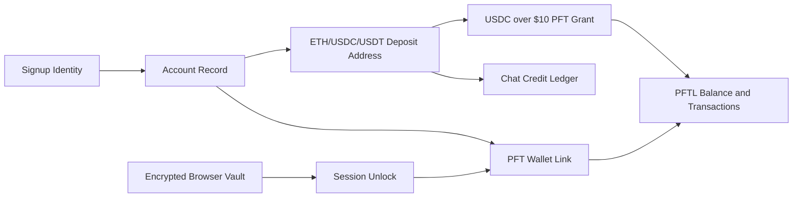

# Wallet

Wallet is the identity and value surface. It shows PFT balance, local seed vault state, reward history, Ethereum top-up state, and transaction activity. A user can use context without a wallet, but tasks require wallet linkage.

## User Flow

1. The user links an existing PFT wallet or creates a new local wallet.
2. The local seed vault is encrypted in the browser with the user's password.
3. The user can unlock, lock, back up, delink, or relink the wallet.
4. Wallet activity is fetched from PFTL and displayed without exposing RPC details in the UX.
5. The user can send native PFT from the linked wallet after unlocking the matching local seed vault. The server prepares and submits the transaction; the browser signs locally.
6. New eligible OAuth accounts may receive a one-time PFT initiation grant after wallet creation only after the matching encrypted local vault is saved.
7. Email-only accounts can receive the same one-time grant after creating a wallet, saving/unlocking the matching local vault, and crediting more than `$10` USDC through the account top-up rail. The wallet page shows a subtle italic note under chat credit until that grant path is satisfied.

## Wallet Help Chat First-Run Copy

This copy is ready to paste into a first-run Wallet help chat.

Designed to answer:

1. What is the Wallet for?
2. Do I need a wallet before I can use Task Node?
3. Why does the wallet lock and unlock?
4. What is the difference between PFT, rewards, and top-up credit?
5. What task states should I understand?
6. How do I submit work?
7. What happens after I submit evidence?
8. Where should I look when I am confused?

Help chat script:

The Wallet is where your PFT address, balance, local vault, top-up status, and signing state live. Your app account proves who you are inside Task Node. Your wallet proves PFT ownership, signs task actions, and receives PFT rewards.

You do not need an unlocked wallet for ordinary chat or reading the app. You do need a linked wallet for task signing and PFT rewards. If you create a wallet, save the seed phrase. Task Node cannot recover it for you.

Locked means the app knows your linked wallet, but your browser has not decrypted the local vault for signing. Unlocked means your browser can sign wallet-bound actions for this session. The server does not receive your seed phrase, private key, wallet password, or decrypted vault.

PFT is the token used for task rewards and wallet actions. Top-up credit is different. Top-up credit pays for app usage, such as model calls. A top-up deposit address is not your PFT wallet.

Task states are simple:

Proposed means a task is offered, but you have not accepted it.
Accepted means the task is on your plate.
Submitted means you sent evidence for review.
Verification requested means the app needs a specific follow-up answer or proof.
Verification response submitted means your follow-up was sent and the task is waiting.
Rewarded means the task lifecycle completed with a reward.
Refused or cancelled means the task is closed without becoming your active work.

To submit work, open Tasks, choose the accepted task, and use Submit evidence. Good evidence is specific: changed files, commands run, test results, screenshots, links, transaction hashes, CIDs, or a short proof note. If the app asks you to unlock the wallet, that is because task evidence is a signed wallet action.

After submission, the task moves through the verification and reward workflow. The app may ask for one follow-up if the evidence is incomplete. If the task is rewarded, the reward appears in your task history and PFT accounting.

### If you're not sure what to do next

Open Tasks first. If you have a proposed task, accept it or refuse it. If you have an accepted task, complete it and submit evidence. If you have a verification request, answer that specific request. If you have no task, use Request task or the Chat `+` button to ask for a personal task.

Open Wallet when an action is blocked by a missing wallet, locked vault, missing seed backup, balance issue, send issue, or top-up issue. Open Help when you need the app explained in plain English. Open Hive when the question is about Network Tasks or group work.

## Technical Architecture

Frontend wallet UX lives in `src/features/wallet/WalletView.jsx`, `src/features/wallet/WalletUnlockModal.jsx`, `src/features/wallet/WalletSeedBackupModal.jsx`, `src/features/wallet/wallet-state.js`, and `src/wallet-core.js`.

Backend wallet logic lives in `server/pftl-balance.js`, `server/pftl-transactions.js`, `server/pftl-faucet.js`, `server/pftl-submit.js`, `server/wallet-send.js`, `server/wallet-proof.js`, and `server/ethereum-deposits.js`.

Wallet linkage belongs to the signup identity account, not only the Post Fiat wallet ID. This lets GitHub, X, Telegram, and future login identities map cleanly into one account model.

## Balance And Activity Freshness

`/api/wallet/balance` reads the current validated PFTL ledger through configured
WSS/RPC `account_info`, with a short server cache unless the browser passes
`force=1`. Signed-in browser sessions with a linked wallet force a fresh balance
read every `1s`, so the fallback path does not wait for the server cache TTL.
`/api/wallet/transactions` reads the Postgres PFTL transaction cache.

The backend PFTL WSS watcher is the chain listener. When it observes a validated
transaction for a tracked wallet, it publishes a `wallet_activity` event through
Postgres `NOTIFY`. The browser listens on authenticated `GET /api/events` using
Server-Sent Events. Matching wallet events force a fresh balance read
immediately, and the Wallet tab refreshes transaction history when it is open.
The existing polling loop remains as the fallback if the browser stream
disconnects: balances force-poll every `1s`, and the Wallet transaction feed
force-polls every `3s` while the Wallet surface is mounted.

## Locking And Unlocking

Wallet linkage and wallet unlock are separate states.

Linkage means the app account has a server-side proof that a PFT address belongs to the user. The server stores wallet metadata and proof records, but it does not receive the seed phrase, wallet password, private key, or browser vault plaintext.

Unlock means the browser has decrypted the local encrypted seed vault for the current session. Unlocking happens in `WalletUnlockModal`, which calls `src/wallet-core.js::unlockEncryptedMnemonicVault` with the user's password and the expected linked address. The decrypted mnemonic is held only in React memory through `walletSecretRef` in `src/main.jsx`; it is cleared when the user locks the vault, logs out, switches accounts, refreshes without preserving the session unlock, or removes the local vault.

The unlock modal is available from multiple surfaces:

1. Wallet tab primary action when the linked wallet has a saved local vault and is locked.
2. Wallet tab local seed vault card.
3. Wallet tab vault status chip next to the wallet address.
4. Sidebar Wallet row or balance/status pill when the vault is locked.
5. Profile dropdown row labeled `Wallet Locked`.
6. Task detail actions such as `Accept task`, `Refuse task`, `Cancel task`, `Submit evidence`, and task request signing.

If the vault is already unlocked, the same wallet control path locks it instead of opening another modal. Locking clears the decrypted mnemonic from memory but does not delink the wallet, delete the encrypted browser vault, delete context, or alter PFT balance/activity caches.

Locked wallets can still show linked address, balance, transaction history, billing top-up state, and cached context. Unlock is required only for wallet-bound private-key actions: sending PFT, signing PFTL pointer transactions, publishing encrypted context to PFTL, decrypting historical encrypted context payloads, task request signing, task acceptance/refusal/cancellation, task evidence submission, verification evidence signing, and seed backup.

## PFT Send

PFT Send is a browser-signed native PFTL `Payment` flow.

1. The user opens Wallet, unlocks the matching local vault, and clicks `Send`.
2. The browser posts destination and amount to `/api/wallet/send/prepare`.
3. The server validates the signed-in account, linked wallet, destination, amount, PFTL balance, reserve, fee, and network id, then returns an autofilled transaction JSON.
4. The browser signs the prepared transaction with `src/wallet-core.js::signPreparedPftlTransaction`.
5. The browser posts only the signed transaction blob, expected destination, and expected amount to `/api/wallet/send/submit`.
6. The server decodes the blob and rejects it unless the source account, destination, amount, transaction type, and `NetworkID` match the prepared payment boundary.
7. The server submits to PFTL and returns transaction hash, ledger index, and engine result.

The API never receives mnemonic, private key, wallet password, or decrypted vault material. Send is not the Ethereum billing top-up rail and does not move USDC/USDT/ETH.

When a task modal opens the unlock flow, the task detail modal remains in place behind the wallet unlock modal. A successful unlock returns the user to the same task action instead of forcing them to close the task and navigate to Wallet.

If a linked wallet has no saved local vault, the app cannot unlock from the modal because there is nothing local to decrypt. In that case the user must relink/import or create a local vault from the Wallet tab.

## Data Model

- Local seed vault: browser-only encrypted custody material.
- Linked wallet metadata: server account record.
- Session unlock secret: in-memory browser state only, never persisted server-side.
- PFT balance and activity: PFTL-derived cache.
- Ethereum top-ups: account-scoped Ethereum deposit addresses and observed
  token deposits. These addresses are derived from the operator receive xpub,
  not from the user's linked PFT wallet. The web app stores xpub-derived
  address/index metadata and balance sync state; the mnemonic, receive xprv,
  and child private keys stay outside the app with operator custody.
- Initiation grant register: one grant per eligible account or wallet, whether it came from OAuth wallet creation or the qualifying USDC top-up path. Eligibility is server-side, but payout is user-initiated from the browser only after the matching local vault is saved or unlocked.
- Account deletion audit: deleting an account writes an `account_deletion_audit` record with account id, archive id, wallet/deposit addresses when present, hashed provider identities, hashed email, and non-secret profile labels. Initiation grant eligibility uses this audit to prevent deleting and recreating the same identity to farm the faucet.

## Diagram

## Failure Modes

- If the vault is locked, show locked state without erasing wallet linkage.
- If the user clicks a locked wallet state, open unlock where possible instead of forcing navigation to the Wallet tab.
- If the encrypted local vault is missing, send the user to the Wallet tab to relink or create a vault.
- If the user clicks Send with a locked vault, open unlock before showing the send form.
- If a signed send transaction does not match the linked wallet, destination, amount, or PFTL network id, reject it before submission.
- Delinking should not delete context.
- Existing linked wallet conflicts should be resolved at the account-link boundary.
- Balance reads should show loading or error, never `NaN`, `undefined`, or fake freshness.
- Wallet creation and USDC top-up sync must not auto-send an initiation grant before the matching local seed vault is saved or unlocked.
- A qualifying USDC top-up should not create duplicate PFT grants if the account
  or wallet already has a processing, completed, or unknown initiation grant.
- Recreated accounts with a matching deletion audit are ineligible for another initiation grant unless explicitly exempted for QA.
- QA exemptions are controlled with `TASKNODE_DELETION_FAUCET_GUARD_EXEMPT_ACCOUNT_IDS`, `TASKNODE_DELETION_FAUCET_GUARD_EXEMPT_WALLETS`, `TASKNODE_DELETION_FAUCET_GUARD_EXEMPT_IDENTITY_HASHES`, or `TASKNODE_DELETION_FAUCET_GUARD_EXEMPT_EMAIL_HASHES`. The guard defaults on and can be disabled with `TASKNODE_DELETION_FAUCET_GUARD_ENABLED=false`.
