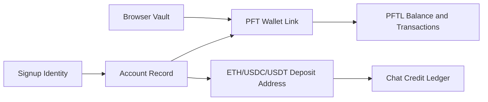

# Wallet

Wallet is the identity and value surface. It shows PFT balance, local seed vault state, reward history, Ethereum top-up state, and transaction activity. A user can use context without a wallet, but tasks require wallet linkage.

## User Flow

1. The user links an existing PFT wallet or creates a new local wallet.
2. The local seed vault is encrypted in the browser with the user's password.
3. The user can unlock, lock, back up, delink, or relink the wallet.
4. Wallet activity is fetched from PFTL and displayed without exposing RPC details in the UX.
5. New eligible non-email accounts may receive a one-time PFT initiation grant.

## Technical Architecture

Frontend wallet UX lives in `src/features/wallet/WalletView.jsx`, `src/features/wallet/WalletSeedBackupModal.jsx`, `src/features/wallet/wallet-state.js`, and `src/wallet-core.js`.

Backend wallet logic lives in `server/pftl-balance.js`, `server/pftl-transactions.js`, `server/pftl-faucet.js`, `server/pftl-submit.js`, `server/wallet-proof.js`, and `server/ethereum-deposits.js`.

Wallet linkage belongs to the signup identity account, not only the Post Fiat wallet ID. This lets GitHub, X, Telegram, and future login identities map cleanly into one account model.

## Data Model

- Local seed vault: browser-only encrypted custody material.
- Linked wallet metadata: server account record.
- PFT balance and activity: PFTL-derived cache.
- Ethereum top-ups: generated deposit addresses and observed token deposits.
- Initiation grant register: one grant per eligible account identity.

## Diagram

## Failure Modes

- If the vault is locked, show locked state without erasing wallet linkage.
- Delinking should not delete context.
- Existing linked wallet conflicts should be resolved at the account-link boundary.
- Balance reads should show loading or error, never `NaN`, `undefined`, or fake freshness.

